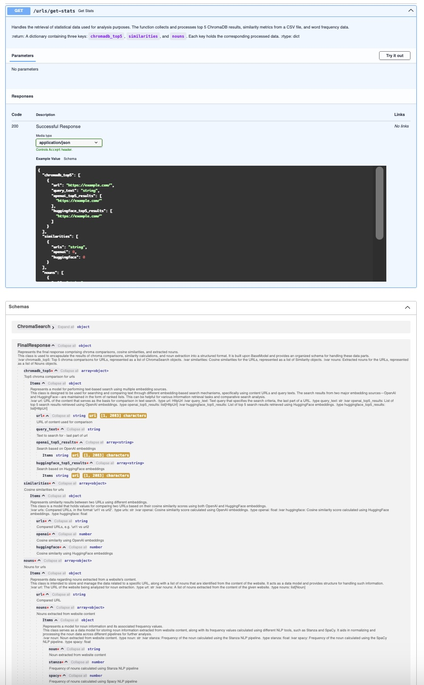

# Website content analysis

Comparison of 20 wikipedia articles.<br>
Articles are in polish.

## Goals

The goal is to calculate cosine similarities and nouns frequencies for preselected wikipedia sites.<br>
Sites are preselected in such a way to have a few sites from a few topics not related to each other
and see how the final similarity will look like.<br>

Topics:
* LLM models
* ML libraries
* books written by Pratchett
* astronomical objects
* astrophysics topics
* my favourite photos :) -> Pale Blue Dot and The Blue Marble
* Greek mythology / books written by Homer

### Fetching and preprocessing content

Articles are fetched from wikipedia using `aiohttp` and `beautifulsoup` lib is used to extract text from content.

#### Embeddings

Embeddings are created in chromaDB using:
* `text-embedding-3-small` model from OpenAI
* `sentence-transformers/all-mpnet-base-v2` model from HuggingFace

> Note: Cosine similarities and top5 calculations are based on embeddings.

> Note: Two models from HuggingFace were tested and `sentence-transformers/all-mpnet-base-v2` gave better results than
> `sentence-transformers/all-MiniLM-L6-v2`. Closer to results from OpenAI and common sense.

> Note: Results calculated using OpenAI model are usually closer truth than those calculated by tested models from HuggingFace.
> Usually HuggingFace model gives higher values of cosine similarities for texts which are not similar, like below.
```json
{
      "urls": "https://pl.wikipedia.org/wiki/Dysk_akrecyjny vs https://pl.wikipedia.org/wiki/Agamemnon",
      "openai": 0.2825,
      "huggingface": 0.5795
}
```

### Finding similarities between contents

#### `distance.cosine` from `scipy.spatial`

`distance.cosine` is used to calculate similarities for all urls combinations.<br>
Cosine similarities are created both for embeddings from OpenAI and HuggingFace.

#### top 5 results from chromaDB search

Last part of url is used as query search and top 5 results are presented.<br>
Top5 is prepared both from OpenAI and HuggingFace separately.

It is a good opportunity to see how search based on similarities can be sometimes misleading.<br>

For example I chose the following articles in my test set:
* https://pl.wikipedia.org/wiki/Dysk_akrecyjny (astrophysics)
* https://pl.wikipedia.org/wiki/Zbrojni (Discworld by Pratchett)
* https://pl.wikipedia.org/wiki/Muzyka_duszy (Discworld by Pratchett)

And top5 for the 1st position (OpenAI):
```json
"chromadb_search": {
        "query_text": "Dysk akrecyjny",
        "top_5_results": [
          "https://pl.wikipedia.org/wiki/Dysk_akrecyjny",
          "https://pl.wikipedia.org/wiki/Zbrojni",
          "https://pl.wikipedia.org/wiki/Muzyka_duszy",
          "https://pl.wikipedia.org/wiki/The_Blue_Marble",
          "https://pl.wikipedia.org/wiki/Agamemnon"
        ]
      }
```

### List of nouns from content with their frequencies

Nouns frequencies are calculated using:
* `spacy` library and its `pl_core_news_sm` language package.
* `stanza` library and its `pl` language package.

> Note: Nouns having at least 2 occurrences are displayed.

> Note: Calculations performed by `stanza` need more time but also results look better than
> those created using `spacy`.

## Swagger docs view for the stats endpoint



## Response generated by stats endpoint

```json
{
  "chromadb_top5": [
    {
      "url": "https://pl.wikipedia.org/wiki/ChatGPT",
      "query_text": "ChatGPT",
      "openai_top5_results": [
        "https://pl.wikipedia.org/wiki/ChatGPT",
        "https://pl.wikipedia.org/wiki/PLLuM",
        "https://pl.wikipedia.org/wiki/Retrieval-augmented_generation",
        "https://pl.wikipedia.org/wiki/Hugging_Face",
        "https://pl.wikipedia.org/wiki/PyTorch"
      ],
      "huggingface_top5_results": [
        "https://pl.wikipedia.org/wiki/ChatGPT",
        "https://pl.wikipedia.org/wiki/PyTorch",
        "https://pl.wikipedia.org/wiki/PLLuM",
        "https://pl.wikipedia.org/wiki/Hugging_Face",
        "https://pl.wikipedia.org/wiki/Penelopa"
      ]
    },
    {
      "url": "https://pl.wikipedia.org/wiki/Retrieval-augmented_generation",
      "query_text": "Retrieval-augmented generation",
      "openai_top5_results": [
        "https://pl.wikipedia.org/wiki/Retrieval-augmented_generation",
        "https://pl.wikipedia.org/wiki/ChatGPT",
        "https://pl.wikipedia.org/wiki/Hugging_Face",
        "https://pl.wikipedia.org/wiki/PLLuM",
        "https://pl.wikipedia.org/wiki/Dysk_akrecyjny"
      ],
      "huggingface_top5_results": [
        "https://pl.wikipedia.org/wiki/Retrieval-augmented_generation",
        "https://pl.wikipedia.org/wiki/ChatGPT",
        "https://pl.wikipedia.org/wiki/PLLuM",
        "https://pl.wikipedia.org/wiki/PyTorch",
        "https://pl.wikipedia.org/wiki/TensorFlow"
      ]
    },
    {
      "url": "https://pl.wikipedia.org/wiki/PLLuM",
      "query_text": "PLLuM",
      "openai_top5_results": [
        "https://pl.wikipedia.org/wiki/PLLuM",
        "https://pl.wikipedia.org/wiki/ChatGPT",
        "https://pl.wikipedia.org/wiki/PyTorch",
        "https://pl.wikipedia.org/wiki/Retrieval-augmented_generation",
        "https://pl.wikipedia.org/wiki/Pale_Blue_Dot"
      ],
      "huggingface_top5_results": [
        "https://pl.wikipedia.org/wiki/PLLuM",
        "https://pl.wikipedia.org/wiki/Hugging_Face",
        "https://pl.wikipedia.org/wiki/PyTorch",
        "https://pl.wikipedia.org/wiki/Penelopa",
        "https://pl.wikipedia.org/wiki/Muzyka_duszy"
      ]
    },
    {
      "url": "https://pl.wikipedia.org/wiki/Hugging_Face",
      "query_text": "Hugging Face",
      "openai_top5_results": [
        "https://pl.wikipedia.org/wiki/Hugging_Face",
        "https://pl.wikipedia.org/wiki/ChatGPT",
        "https://pl.wikipedia.org/wiki/Hekabe",
        "https://pl.wikipedia.org/wiki/Pale_Blue_Dot",
        "https://pl.wikipedia.org/wiki/PLLuM"
      ],
      "huggingface_top5_results": [
        "https://pl.wikipedia.org/wiki/Hugging_Face",
        "https://pl.wikipedia.org/wiki/Muzyka_duszy",
        "https://pl.wikipedia.org/wiki/PyTorch",
        "https://pl.wikipedia.org/wiki/Soczewkowanie_grawitacyjne",
        "https://pl.wikipedia.org/wiki/TensorFlow"
      ]
    },
    {
      "url": "https://pl.wikipedia.org/wiki/PyTorch",
      "query_text": "PyTorch",
      "openai_top5_results": [
        "https://pl.wikipedia.org/wiki/PyTorch",
        "https://pl.wikipedia.org/wiki/TensorFlow",
        "https://pl.wikipedia.org/wiki/ChatGPT",
        "https://pl.wikipedia.org/wiki/Hugging_Face",
        "https://pl.wikipedia.org/wiki/PLLuM"
      ],
      "huggingface_top5_results": [
        "https://pl.wikipedia.org/wiki/PyTorch",
        "https://pl.wikipedia.org/wiki/TensorFlow",
        "https://pl.wikipedia.org/wiki/Hugging_Face",
        "https://pl.wikipedia.org/wiki/ChatGPT",
        "https://pl.wikipedia.org/wiki/Retrieval-augmented_generation"
      ]
    },
    {
      "url": "https://pl.wikipedia.org/wiki/TensorFlow",
      "query_text": "TensorFlow",
      "openai_top5_results": [
        "https://pl.wikipedia.org/wiki/TensorFlow",
        "https://pl.wikipedia.org/wiki/PyTorch",
        "https://pl.wikipedia.org/wiki/Hugging_Face",
        "https://pl.wikipedia.org/wiki/ChatGPT",
        "https://pl.wikipedia.org/wiki/PLLuM"
      ],
      "huggingface_top5_results": [
        "https://pl.wikipedia.org/wiki/TensorFlow",
        "https://pl.wikipedia.org/wiki/PyTorch",
        "https://pl.wikipedia.org/wiki/Hugging_Face",
        "https://pl.wikipedia.org/wiki/Retrieval-augmented_generation",
        "https://pl.wikipedia.org/wiki/PLLuM"
      ]
    },
    {
      "url": "https://pl.wikipedia.org/wiki/Kwazar",
      "query_text": "Kwazar",
      "openai_top5_results": [
        "https://pl.wikipedia.org/wiki/Kwazar",
        "https://pl.wikipedia.org/wiki/Blazar",
        "https://pl.wikipedia.org/wiki/Soczewkowanie_grawitacyjne",
        "https://pl.wikipedia.org/wiki/Dysk_akrecyjny",
        "https://pl.wikipedia.org/wiki/Ciemna_energia"
      ],
      "huggingface_top5_results": [
        "https://pl.wikipedia.org/wiki/Kwazar",
        "https://pl.wikipedia.org/wiki/Hekabe",
        "https://pl.wikipedia.org/wiki/Agamemnon",
        "https://pl.wikipedia.org/wiki/PyTorch",
        "https://pl.wikipedia.org/wiki/Soczewkowanie_grawitacyjne"
      ]
    },
    {
      "url": "https://pl.wikipedia.org/wiki/Blazar",
      "query_text": "Blazar",
      "openai_top5_results": [
        "https://pl.wikipedia.org/wiki/Blazar",
        "https://pl.wikipedia.org/wiki/Kwazar",
        "https://pl.wikipedia.org/wiki/Dysk_akrecyjny",
        "https://pl.wikipedia.org/wiki/Soczewkowanie_grawitacyjne",
        "https://pl.wikipedia.org/wiki/Ciemna_energia"
      ],
      "huggingface_top5_results": [
        "https://pl.wikipedia.org/wiki/Blazar",
        "https://pl.wikipedia.org/wiki/PyTorch",
        "https://pl.wikipedia.org/wiki/The_Blue_Marble",
        "https://pl.wikipedia.org/wiki/Kwazar",
        "https://pl.wikipedia.org/wiki/Dysk_akrecyjny"
      ]
    },
    {
      "url": "https://pl.wikipedia.org/wiki/Dysk_akrecyjny",
      "query_text": "Dysk akrecyjny",
      "openai_top5_results": [
        "https://pl.wikipedia.org/wiki/Dysk_akrecyjny",
        "https://pl.wikipedia.org/wiki/Zbrojni",
        "https://pl.wikipedia.org/wiki/Muzyka_duszy",
        "https://pl.wikipedia.org/wiki/The_Blue_Marble",
        "https://pl.wikipedia.org/wiki/Agamemnon"
      ],
      "huggingface_top5_results": [
        "https://pl.wikipedia.org/wiki/Muzyka_duszy",
        "https://pl.wikipedia.org/wiki/Zbrojni",
        "https://pl.wikipedia.org/wiki/Soczewkowanie_grawitacyjne",
        "https://pl.wikipedia.org/wiki/PyTorch",
        "https://pl.wikipedia.org/wiki/Hekabe"
      ]
    },
    {
      "url": "https://pl.wikipedia.org/wiki/Soczewkowanie_grawitacyjne",
      "query_text": "Soczewkowanie grawitacyjne",
      "openai_top5_results": [
        "https://pl.wikipedia.org/wiki/Soczewkowanie_grawitacyjne",
        "https://pl.wikipedia.org/wiki/Retrieval-augmented_generation",
        "https://pl.wikipedia.org/wiki/Blazar",
        "https://pl.wikipedia.org/wiki/Dysk_akrecyjny",
        "https://pl.wikipedia.org/wiki/ChatGPT"
      ],
      "huggingface_top5_results": [
        "https://pl.wikipedia.org/wiki/Soczewkowanie_grawitacyjne",
        "https://pl.wikipedia.org/wiki/Muzyka_duszy",
        "https://pl.wikipedia.org/wiki/Zbrojni",
        "https://pl.wikipedia.org/wiki/ChatGPT",
        "https://pl.wikipedia.org/wiki/Hekabe"
      ]
    },
    {
      "url": "https://pl.wikipedia.org/wiki/Ciemna_energia",
      "query_text": "Ciemna energia",
      "openai_top5_results": [
        "https://pl.wikipedia.org/wiki/Ciemna_energia",
        "https://pl.wikipedia.org/wiki/Dysk_akrecyjny",
        "https://pl.wikipedia.org/wiki/Blazar",
        "https://pl.wikipedia.org/wiki/Kwazar",
        "https://pl.wikipedia.org/wiki/Soczewkowanie_grawitacyjne"
      ],
      "huggingface_top5_results": [
        "https://pl.wikipedia.org/wiki/Ciemna_energia",
        "https://pl.wikipedia.org/wiki/Agamemnon",
        "https://pl.wikipedia.org/wiki/Blazar",
        "https://pl.wikipedia.org/wiki/Sen_Agamemnona",
        "https://pl.wikipedia.org/wiki/Hekabe"
      ]
    },
    {
      "url": "https://pl.wikipedia.org/wiki/Zbrojni",
      "query_text": "Zbrojni",
      "openai_top5_results": [
        "https://pl.wikipedia.org/wiki/Zbrojni",
        "https://pl.wikipedia.org/wiki/PLLuM",
        "https://pl.wikipedia.org/wiki/Soczewkowanie_grawitacyjne",
        "https://pl.wikipedia.org/wiki/Ciemna_energia",
        "https://pl.wikipedia.org/wiki/Blazar"
      ],
      "huggingface_top5_results": [
        "https://pl.wikipedia.org/wiki/Soczewkowanie_grawitacyjne",
        "https://pl.wikipedia.org/wiki/Muzyka_duszy",
        "https://pl.wikipedia.org/wiki/Zbrojni",
        "https://pl.wikipedia.org/wiki/The_Blue_Marble",
        "https://pl.wikipedia.org/wiki/PLLuM"
      ]
    },
    {
      "url": "https://pl.wikipedia.org/wiki/Muzyka_duszy",
      "query_text": "Muzyka duszy",
      "openai_top5_results": [
        "https://pl.wikipedia.org/wiki/Muzyka_duszy",
        "https://pl.wikipedia.org/wiki/Dysk_akrecyjny",
        "https://pl.wikipedia.org/wiki/Zbrojni",
        "https://pl.wikipedia.org/wiki/Pale_Blue_Dot",
        "https://pl.wikipedia.org/wiki/Ciemna_energia"
      ],
      "huggingface_top5_results": [
        "https://pl.wikipedia.org/wiki/Muzyka_duszy",
        "https://pl.wikipedia.org/wiki/Soczewkowanie_grawitacyjne",
        "https://pl.wikipedia.org/wiki/The_Blue_Marble",
        "https://pl.wikipedia.org/wiki/PyTorch",
        "https://pl.wikipedia.org/wiki/Hekabe"
      ]
    },
    {
      "url": "https://pl.wikipedia.org/wiki/Pale_Blue_Dot",
      "query_text": "Pale Blue Dot",
      "openai_top5_results": [
        "https://pl.wikipedia.org/wiki/Pale_Blue_Dot",
        "https://pl.wikipedia.org/wiki/The_Blue_Marble",
        "https://pl.wikipedia.org/wiki/Soczewkowanie_grawitacyjne",
        "https://pl.wikipedia.org/wiki/Dysk_akrecyjny",
        "https://pl.wikipedia.org/wiki/Ciemna_energia"
      ],
      "huggingface_top5_results": [
        "https://pl.wikipedia.org/wiki/Pale_Blue_Dot",
        "https://pl.wikipedia.org/wiki/Agamemnon",
        "https://pl.wikipedia.org/wiki/The_Blue_Marble",
        "https://pl.wikipedia.org/wiki/Kwazar",
        "https://pl.wikipedia.org/wiki/Hekabe"
      ]
    },
    {
      "url": "https://pl.wikipedia.org/wiki/The_Blue_Marble",
      "query_text": "The Blue Marble",
      "openai_top5_results": [
        "https://pl.wikipedia.org/wiki/The_Blue_Marble",
        "https://pl.wikipedia.org/wiki/Pale_Blue_Dot",
        "https://pl.wikipedia.org/wiki/Soczewkowanie_grawitacyjne",
        "https://pl.wikipedia.org/wiki/Ciemna_energia",
        "https://pl.wikipedia.org/wiki/Kwazar"
      ],
      "huggingface_top5_results": [
        "https://pl.wikipedia.org/wiki/The_Blue_Marble",
        "https://pl.wikipedia.org/wiki/Pale_Blue_Dot",
        "https://pl.wikipedia.org/wiki/Sen_Agamemnona",
        "https://pl.wikipedia.org/wiki/Achilles",
        "https://pl.wikipedia.org/wiki/Agamemnon"
      ]
    },
    {
      "url": "https://pl.wikipedia.org/wiki/Hekabe",
      "query_text": "Hekabe",
      "openai_top5_results": [
        "https://pl.wikipedia.org/wiki/Hekabe",
        "https://pl.wikipedia.org/wiki/Penelopa",
        "https://pl.wikipedia.org/wiki/Achilles",
        "https://pl.wikipedia.org/wiki/Sen_Agamemnona",
        "https://pl.wikipedia.org/wiki/Hugging_Face"
      ],
      "huggingface_top5_results": [
        "https://pl.wikipedia.org/wiki/Hekabe",
        "https://pl.wikipedia.org/wiki/Hugging_Face",
        "https://pl.wikipedia.org/wiki/ChatGPT",
        "https://pl.wikipedia.org/wiki/Muzyka_duszy",
        "https://pl.wikipedia.org/wiki/PyTorch"
      ]
    },
    {
      "url": "https://pl.wikipedia.org/wiki/Achilles",
      "query_text": "Achilles",
      "openai_top5_results": [
        "https://pl.wikipedia.org/wiki/Achilles",
        "https://pl.wikipedia.org/wiki/Agamemnon",
        "https://pl.wikipedia.org/wiki/Hekabe",
        "https://pl.wikipedia.org/wiki/Sen_Agamemnona",
        "https://pl.wikipedia.org/wiki/Penelopa"
      ],
      "huggingface_top5_results": [
        "https://pl.wikipedia.org/wiki/Achilles",
        "https://pl.wikipedia.org/wiki/Sen_Agamemnona",
        "https://pl.wikipedia.org/wiki/Zbrojni",
        "https://pl.wikipedia.org/wiki/TensorFlow",
        "https://pl.wikipedia.org/wiki/Penelopa"
      ]
    },
    {
      "url": "https://pl.wikipedia.org/wiki/Agamemnon",
      "query_text": "Agamemnon",
      "openai_top5_results": [
        "https://pl.wikipedia.org/wiki/Agamemnon",
        "https://pl.wikipedia.org/wiki/Sen_Agamemnona",
        "https://pl.wikipedia.org/wiki/Penelopa",
        "https://pl.wikipedia.org/wiki/Hekabe",
        "https://pl.wikipedia.org/wiki/Achilles"
      ],
      "huggingface_top5_results": [
        "https://pl.wikipedia.org/wiki/Sen_Agamemnona",
        "https://pl.wikipedia.org/wiki/Agamemnon",
        "https://pl.wikipedia.org/wiki/Achilles",
        "https://pl.wikipedia.org/wiki/Kwazar",
        "https://pl.wikipedia.org/wiki/Hekabe"
      ]
    },
    {
      "url": "https://pl.wikipedia.org/wiki/Sen_Agamemnona",
      "query_text": "Sen Agamemnona",
      "openai_top5_results": [
        "https://pl.wikipedia.org/wiki/Agamemnon",
        "https://pl.wikipedia.org/wiki/Sen_Agamemnona",
        "https://pl.wikipedia.org/wiki/Hekabe",
        "https://pl.wikipedia.org/wiki/Achilles",
        "https://pl.wikipedia.org/wiki/Penelopa"
      ],
      "huggingface_top5_results": [
        "https://pl.wikipedia.org/wiki/Sen_Agamemnona",
        "https://pl.wikipedia.org/wiki/Agamemnon",
        "https://pl.wikipedia.org/wiki/Achilles",
        "https://pl.wikipedia.org/wiki/Hekabe",
        "https://pl.wikipedia.org/wiki/Penelopa"
      ]
    },
    {
      "url": "https://pl.wikipedia.org/wiki/Penelopa",
      "query_text": "Penelopa",
      "openai_top5_results": [
        "https://pl.wikipedia.org/wiki/Penelopa",
        "https://pl.wikipedia.org/wiki/Sen_Agamemnona",
        "https://pl.wikipedia.org/wiki/Hekabe",
        "https://pl.wikipedia.org/wiki/Pale_Blue_Dot",
        "https://pl.wikipedia.org/wiki/Agamemnon"
      ],
      "huggingface_top5_results": [
        "https://pl.wikipedia.org/wiki/Penelopa",
        "https://pl.wikipedia.org/wiki/Sen_Agamemnona",
        "https://pl.wikipedia.org/wiki/Hekabe",
        "https://pl.wikipedia.org/wiki/PLLuM",
        "https://pl.wikipedia.org/wiki/Pale_Blue_Dot"
      ]
    }
  ],
  "similarities": [
    {
      "urls": "https://pl.wikipedia.org/wiki/Pale_Blue_Dot vs https://pl.wikipedia.org/wiki/The_Blue_Marble",
      "openai": 0.7367,
      "huggingface": 0.6406
    },
    {
      "urls": "https://pl.wikipedia.org/wiki/PyTorch vs https://pl.wikipedia.org/wiki/TensorFlow",
      "openai": 0.6975,
      "huggingface": 0.7172
    },
    {
      "urls": "https://pl.wikipedia.org/wiki/Achilles vs https://pl.wikipedia.org/wiki/Agamemnon",
      "openai": 0.6953,
      "huggingface": 0.4576
    },
    {
      "urls": "https://pl.wikipedia.org/wiki/Kwazar vs https://pl.wikipedia.org/wiki/Blazar",
      "openai": 0.691,
      "huggingface": 0.4407
    },
    {
      "urls": "https://pl.wikipedia.org/wiki/ChatGPT vs https://pl.wikipedia.org/wiki/PLLuM",
      "openai": 0.684,
      "huggingface": 0.6815
    },
    {
      "urls": "https://pl.wikipedia.org/wiki/Zbrojni vs https://pl.wikipedia.org/wiki/Muzyka_duszy",
      "openai": 0.683,
      "huggingface": 0.7835
    },
    {
      "urls": "https://pl.wikipedia.org/wiki/Hekabe vs https://pl.wikipedia.org/wiki/Penelopa",
      "openai": 0.656,
      "huggingface": 0.6587
    },
    {
      "urls": "https://pl.wikipedia.org/wiki/Soczewkowanie_grawitacyjne vs https://pl.wikipedia.org/wiki/Ciemna_energia",
      "openai": 0.6474,
      "huggingface": 0.3936
    },
    {
      "urls": "https://pl.wikipedia.org/wiki/Hekabe vs https://pl.wikipedia.org/wiki/Achilles",
      "openai": 0.6399,
      "huggingface": 0.551
    },
    {
      "urls": "https://pl.wikipedia.org/wiki/Kwazar vs https://pl.wikipedia.org/wiki/Dysk_akrecyjny",
      "openai": 0.6281,
      "huggingface": 0.6553
    },
    {
      "urls": "https://pl.wikipedia.org/wiki/Agamemnon vs https://pl.wikipedia.org/wiki/Sen_Agamemnona",
      "openai": 0.6169,
      "huggingface": 0.5724
    },
    {
      "urls": "https://pl.wikipedia.org/wiki/Kwazar vs https://pl.wikipedia.org/wiki/Ciemna_energia",
      "openai": 0.6149,
      "huggingface": 0.5217
    },
    {
      "urls": "https://pl.wikipedia.org/wiki/Achilles vs https://pl.wikipedia.org/wiki/Penelopa",
      "openai": 0.6035,
      "huggingface": 0.5467
    },
    {
      "urls": "https://pl.wikipedia.org/wiki/Blazar vs https://pl.wikipedia.org/wiki/Dysk_akrecyjny",
      "openai": 0.6027,
      "huggingface": 0.5869
    },
    {
      "urls": "https://pl.wikipedia.org/wiki/Kwazar vs https://pl.wikipedia.org/wiki/Soczewkowanie_grawitacyjne",
      "openai": 0.5949,
      "huggingface": 0.4126
    },
    {
      "urls": "https://pl.wikipedia.org/wiki/Dysk_akrecyjny vs https://pl.wikipedia.org/wiki/Ciemna_energia",
      "openai": 0.5898,
      "huggingface": 0.6771
    },
    {
      "urls": "https://pl.wikipedia.org/wiki/Blazar vs https://pl.wikipedia.org/wiki/Soczewkowanie_grawitacyjne",
      "openai": 0.577,
      "huggingface": 0.4404
    },
    {
      "urls": "https://pl.wikipedia.org/wiki/Achilles vs https://pl.wikipedia.org/wiki/Sen_Agamemnona",
      "openai": 0.567,
      "huggingface": 0.6426
    },
    {
      "urls": "https://pl.wikipedia.org/wiki/Blazar vs https://pl.wikipedia.org/wiki/Ciemna_energia",
      "openai": 0.5633,
      "huggingface": 0.4526
    },
    {
      "urls": "https://pl.wikipedia.org/wiki/Dysk_akrecyjny vs https://pl.wikipedia.org/wiki/Soczewkowanie_grawitacyjne",
      "openai": 0.5602,
      "huggingface": 0.4798
    },
    {
      "urls": "https://pl.wikipedia.org/wiki/Hekabe vs https://pl.wikipedia.org/wiki/Agamemnon",
      "openai": 0.5535,
      "huggingface": 0.7062
    },
    {
      "urls": "https://pl.wikipedia.org/wiki/Agamemnon vs https://pl.wikipedia.org/wiki/Penelopa",
      "openai": 0.5512,
      "huggingface": 0.6002
    },
    {
      "urls": "https://pl.wikipedia.org/wiki/ChatGPT vs https://pl.wikipedia.org/wiki/Hugging_Face",
      "openai": 0.5446,
      "huggingface": 0.4662
    },
    {
      "urls": "https://pl.wikipedia.org/wiki/ChatGPT vs https://pl.wikipedia.org/wiki/Retrieval-augmented_generation",
      "openai": 0.5341,
      "huggingface": 0.5922
    },
    {
      "urls": "https://pl.wikipedia.org/wiki/ChatGPT vs https://pl.wikipedia.org/wiki/PyTorch",
      "openai": 0.5189,
      "huggingface": 0.6205
    },
    {
      "urls": "https://pl.wikipedia.org/wiki/Sen_Agamemnona vs https://pl.wikipedia.org/wiki/Penelopa",
      "openai": 0.5141,
      "huggingface": 0.4769
    },
    {
      "urls": "https://pl.wikipedia.org/wiki/Hekabe vs https://pl.wikipedia.org/wiki/Sen_Agamemnona",
      "openai": 0.5099,
      "huggingface": 0.4868
    },
    {
      "urls": "https://pl.wikipedia.org/wiki/ChatGPT vs https://pl.wikipedia.org/wiki/TensorFlow",
      "openai": 0.5084,
      "huggingface": 0.4924
    },
    {
      "urls": "https://pl.wikipedia.org/wiki/Retrieval-augmented_generation vs https://pl.wikipedia.org/wiki/PLLuM",
      "openai": 0.5046,
      "huggingface": 0.5542
    },
    {
      "urls": "https://pl.wikipedia.org/wiki/Ciemna_energia vs https://pl.wikipedia.org/wiki/Pale_Blue_Dot",
      "openai": 0.4949,
      "huggingface": 0.4558
    },
    {
      "urls": "https://pl.wikipedia.org/wiki/Soczewkowanie_grawitacyjne vs https://pl.wikipedia.org/wiki/Pale_Blue_Dot",
      "openai": 0.4664,
      "huggingface": 0.3981
    },
    {
      "urls": "https://pl.wikipedia.org/wiki/Hugging_Face vs https://pl.wikipedia.org/wiki/PyTorch",
      "openai": 0.4624,
      "huggingface": 0.5019
    },
    {
      "urls": "https://pl.wikipedia.org/wiki/Dysk_akrecyjny vs https://pl.wikipedia.org/wiki/Pale_Blue_Dot",
      "openai": 0.4621,
      "huggingface": 0.6863
    },
    {
      "urls": "https://pl.wikipedia.org/wiki/PLLuM vs https://pl.wikipedia.org/wiki/PyTorch",
      "openai": 0.4373,
      "huggingface": 0.612
    },
    {
      "urls": "https://pl.wikipedia.org/wiki/Hugging_Face vs https://pl.wikipedia.org/wiki/TensorFlow",
      "openai": 0.4342,
      "huggingface": 0.3825
    },
    {
      "urls": "https://pl.wikipedia.org/wiki/Kwazar vs https://pl.wikipedia.org/wiki/Pale_Blue_Dot",
      "openai": 0.4316,
      "huggingface": 0.6834
    },
    {
      "urls": "https://pl.wikipedia.org/wiki/Soczewkowanie_grawitacyjne vs https://pl.wikipedia.org/wiki/The_Blue_Marble",
      "openai": 0.4044,
      "huggingface": 0.5076
    },
    {
      "urls": "https://pl.wikipedia.org/wiki/Ciemna_energia vs https://pl.wikipedia.org/wiki/The_Blue_Marble",
      "openai": 0.402,
      "huggingface": 0.444
    },
    {
      "urls": "https://pl.wikipedia.org/wiki/Dysk_akrecyjny vs https://pl.wikipedia.org/wiki/The_Blue_Marble",
      "openai": 0.3921,
      "huggingface": 0.631
    },
    {
      "urls": "https://pl.wikipedia.org/wiki/PLLuM vs https://pl.wikipedia.org/wiki/TensorFlow",
      "openai": 0.3905,
      "huggingface": 0.482
    },
    {
      "urls": "https://pl.wikipedia.org/wiki/Kwazar vs https://pl.wikipedia.org/wiki/The_Blue_Marble",
      "openai": 0.389,
      "huggingface": 0.4779
    },
    {
      "urls": "https://pl.wikipedia.org/wiki/PLLuM vs https://pl.wikipedia.org/wiki/Hugging_Face",
      "openai": 0.3847,
      "huggingface": 0.5321
    },
    {
      "urls": "https://pl.wikipedia.org/wiki/Blazar vs https://pl.wikipedia.org/wiki/Pale_Blue_Dot",
      "openai": 0.3688,
      "huggingface": 0.4326
    },
    {
      "urls": "https://pl.wikipedia.org/wiki/Retrieval-augmented_generation vs https://pl.wikipedia.org/wiki/Hugging_Face",
      "openai": 0.3678,
      "huggingface": 0.4217
    },
    {
      "urls": "https://pl.wikipedia.org/wiki/Retrieval-augmented_generation vs https://pl.wikipedia.org/wiki/Blazar",
      "openai": 0.3579,
      "huggingface": 0.279
    },
    {
      "urls": "https://pl.wikipedia.org/wiki/Zbrojni vs https://pl.wikipedia.org/wiki/Achilles",
      "openai": 0.3577,
      "huggingface": 0.4654
    },
    {
      "urls": "https://pl.wikipedia.org/wiki/Dysk_akrecyjny vs https://pl.wikipedia.org/wiki/Muzyka_duszy",
      "openai": 0.3467,
      "huggingface": 0.3769
    },
    {
      "urls": "https://pl.wikipedia.org/wiki/Zbrojni vs https://pl.wikipedia.org/wiki/Sen_Agamemnona",
      "openai": 0.3442,
      "huggingface": 0.3915
    },
    {
      "urls": "https://pl.wikipedia.org/wiki/Zbrojni vs https://pl.wikipedia.org/wiki/Agamemnon",
      "openai": 0.3351,
      "huggingface": 0.3612
    },
    {
      "urls": "https://pl.wikipedia.org/wiki/Retrieval-augmented_generation vs https://pl.wikipedia.org/wiki/Soczewkowanie_grawitacyjne",
      "openai": 0.3307,
      "huggingface": 0.3653
    },
    {
      "urls": "https://pl.wikipedia.org/wiki/Retrieval-augmented_generation vs https://pl.wikipedia.org/wiki/TensorFlow",
      "openai": 0.3284,
      "huggingface": 0.4022
    },
    {
      "urls": "https://pl.wikipedia.org/wiki/Blazar vs https://pl.wikipedia.org/wiki/The_Blue_Marble",
      "openai": 0.3244,
      "huggingface": 0.4786
    },
    {
      "urls": "https://pl.wikipedia.org/wiki/Zbrojni vs https://pl.wikipedia.org/wiki/Penelopa",
      "openai": 0.3163,
      "huggingface": 0.4495
    },
    {
      "urls": "https://pl.wikipedia.org/wiki/Zbrojni vs https://pl.wikipedia.org/wiki/Hekabe",
      "openai": 0.3135,
      "huggingface": 0.4162
    },
    {
      "urls": "https://pl.wikipedia.org/wiki/Dysk_akrecyjny vs https://pl.wikipedia.org/wiki/Zbrojni",
      "openai": 0.3122,
      "huggingface": 0.3408
    },
    {
      "urls": "https://pl.wikipedia.org/wiki/ChatGPT vs https://pl.wikipedia.org/wiki/Zbrojni",
      "openai": 0.3106,
      "huggingface": 0.3696
    },
    {
      "urls": "https://pl.wikipedia.org/wiki/Pale_Blue_Dot vs https://pl.wikipedia.org/wiki/Sen_Agamemnona",
      "openai": 0.3069,
      "huggingface": 0.335
    },
    {
      "urls": "https://pl.wikipedia.org/wiki/ChatGPT vs https://pl.wikipedia.org/wiki/Blazar",
      "openai": 0.3043,
      "huggingface": 0.2599
    },
    {
      "urls": "https://pl.wikipedia.org/wiki/Retrieval-augmented_generation vs https://pl.wikipedia.org/wiki/Kwazar",
      "openai": 0.3009,
      "huggingface": 0.2761
    },
    {
      "urls": "https://pl.wikipedia.org/wiki/ChatGPT vs https://pl.wikipedia.org/wiki/The_Blue_Marble",
      "openai": 0.2993,
      "huggingface": 0.3174
    },
    {
      "urls": "https://pl.wikipedia.org/wiki/Muzyka_duszy vs https://pl.wikipedia.org/wiki/Achilles",
      "openai": 0.2959,
      "huggingface": 0.4072
    },
    {
      "urls": "https://pl.wikipedia.org/wiki/Retrieval-augmented_generation vs https://pl.wikipedia.org/wiki/Dysk_akrecyjny",
      "openai": 0.2934,
      "huggingface": 0.2621
    },
    {
      "urls": "https://pl.wikipedia.org/wiki/Ciemna_energia vs https://pl.wikipedia.org/wiki/Zbrojni",
      "openai": 0.2922,
      "huggingface": 0.3459
    },
    {
      "urls": "https://pl.wikipedia.org/wiki/PLLuM vs https://pl.wikipedia.org/wiki/The_Blue_Marble",
      "openai": 0.2916,
      "huggingface": 0.3206
    },
    {
      "urls": "https://pl.wikipedia.org/wiki/ChatGPT vs https://pl.wikipedia.org/wiki/Ciemna_energia",
      "openai": 0.2915,
      "huggingface": 0.268
    },
    {
      "urls": "https://pl.wikipedia.org/wiki/PLLuM vs https://pl.wikipedia.org/wiki/Zbrojni",
      "openai": 0.289,
      "huggingface": 0.364
    },
    {
      "urls": "https://pl.wikipedia.org/wiki/Retrieval-augmented_generation vs https://pl.wikipedia.org/wiki/PyTorch",
      "openai": 0.2882,
      "huggingface": 0.4676
    },
    {
      "urls": "https://pl.wikipedia.org/wiki/Ciemna_energia vs https://pl.wikipedia.org/wiki/Sen_Agamemnona",
      "openai": 0.2861,
      "huggingface": 0.3455
    },
    {
      "urls": "https://pl.wikipedia.org/wiki/ChatGPT vs https://pl.wikipedia.org/wiki/Kwazar",
      "openai": 0.283,
      "huggingface": 0.2675
    },
    {
      "urls": "https://pl.wikipedia.org/wiki/Dysk_akrecyjny vs https://pl.wikipedia.org/wiki/Agamemnon",
      "openai": 0.2825,
      "huggingface": 0.5795
    },
    {
      "urls": "https://pl.wikipedia.org/wiki/PLLuM vs https://pl.wikipedia.org/wiki/Blazar",
      "openai": 0.28,
      "huggingface": 0.3011
    },
    {
      "urls": "https://pl.wikipedia.org/wiki/The_Blue_Marble vs https://pl.wikipedia.org/wiki/Sen_Agamemnona",
      "openai": 0.2787,
      "huggingface": 0.4545
    },
    {
      "urls": "https://pl.wikipedia.org/wiki/ChatGPT vs https://pl.wikipedia.org/wiki/Soczewkowanie_grawitacyjne",
      "openai": 0.2787,
      "huggingface": 0.4529
    },
    {
      "urls": "https://pl.wikipedia.org/wiki/Pale_Blue_Dot vs https://pl.wikipedia.org/wiki/Penelopa",
      "openai": 0.2773,
      "huggingface": 0.4033
    },
    {
      "urls": "https://pl.wikipedia.org/wiki/Soczewkowanie_grawitacyjne vs https://pl.wikipedia.org/wiki/Sen_Agamemnona",
      "openai": 0.2771,
      "huggingface": 0.3952
    },
    {
      "urls": "https://pl.wikipedia.org/wiki/Muzyka_duszy vs https://pl.wikipedia.org/wiki/Penelopa",
      "openai": 0.2762,
      "huggingface": 0.5386
    },
    {
      "urls": "https://pl.wikipedia.org/wiki/Muzyka_duszy vs https://pl.wikipedia.org/wiki/Pale_Blue_Dot",
      "openai": 0.2756,
      "huggingface": 0.3389
    },
    {
      "urls": "https://pl.wikipedia.org/wiki/Retrieval-augmented_generation vs https://pl.wikipedia.org/wiki/Ciemna_energia",
      "openai": 0.2688,
      "huggingface": 0.2923
    },
    {
      "urls": "https://pl.wikipedia.org/wiki/PLLuM vs https://pl.wikipedia.org/wiki/Soczewkowanie_grawitacyjne",
      "openai": 0.267,
      "huggingface": 0.4531
    },
    {
      "urls": "https://pl.wikipedia.org/wiki/Ciemna_energia vs https://pl.wikipedia.org/wiki/Muzyka_duszy",
      "openai": 0.2668,
      "huggingface": 0.3653
    },
    {
      "urls": "https://pl.wikipedia.org/wiki/PyTorch vs https://pl.wikipedia.org/wiki/The_Blue_Marble",
      "openai": 0.2648,
      "huggingface": 0.3861
    },
    {
      "urls": "https://pl.wikipedia.org/wiki/The_Blue_Marble vs https://pl.wikipedia.org/wiki/Achilles",
      "openai": 0.2615,
      "huggingface": 0.4032
    },
    {
      "urls": "https://pl.wikipedia.org/wiki/Dysk_akrecyjny vs https://pl.wikipedia.org/wiki/Achilles",
      "openai": 0.2613,
      "huggingface": 0.2768
    },
    {
      "urls": "https://pl.wikipedia.org/wiki/Dysk_akrecyjny vs https://pl.wikipedia.org/wiki/Sen_Agamemnona",
      "openai": 0.2586,
      "huggingface": 0.4023
    },
    {
      "urls": "https://pl.wikipedia.org/wiki/TensorFlow vs https://pl.wikipedia.org/wiki/Blazar",
      "openai": 0.2568,
      "huggingface": 0.2668
    },
    {
      "urls": "https://pl.wikipedia.org/wiki/PLLuM vs https://pl.wikipedia.org/wiki/Pale_Blue_Dot",
      "openai": 0.2564,
      "huggingface": 0.3269
    },
    {
      "urls": "https://pl.wikipedia.org/wiki/Muzyka_duszy vs https://pl.wikipedia.org/wiki/Hekabe",
      "openai": 0.2543,
      "huggingface": 0.4566
    },
    {
      "urls": "https://pl.wikipedia.org/wiki/PLLuM vs https://pl.wikipedia.org/wiki/Ciemna_energia",
      "openai": 0.2515,
      "huggingface": 0.368
    },
    {
      "urls": "https://pl.wikipedia.org/wiki/TensorFlow vs https://pl.wikipedia.org/wiki/The_Blue_Marble",
      "openai": 0.2507,
      "huggingface": 0.2021
    },
    {
      "urls": "https://pl.wikipedia.org/wiki/Muzyka_duszy vs https://pl.wikipedia.org/wiki/Agamemnon",
      "openai": 0.2466,
      "huggingface": 0.395
    },
    {
      "urls": "https://pl.wikipedia.org/wiki/ChatGPT vs https://pl.wikipedia.org/wiki/Pale_Blue_Dot",
      "openai": 0.2456,
      "huggingface": 0.2493
    },
    {
      "urls": "https://pl.wikipedia.org/wiki/PLLuM vs https://pl.wikipedia.org/wiki/Kwazar",
      "openai": 0.2443,
      "huggingface": 0.3199
    },
    {
      "urls": "https://pl.wikipedia.org/wiki/Ciemna_energia vs https://pl.wikipedia.org/wiki/Achilles",
      "openai": 0.2443,
      "huggingface": 0.2781
    },
    {
      "urls": "https://pl.wikipedia.org/wiki/ChatGPT vs https://pl.wikipedia.org/wiki/Achilles",
      "openai": 0.2438,
      "huggingface": 0.2749
    },
    {
      "urls": "https://pl.wikipedia.org/wiki/Muzyka_duszy vs https://pl.wikipedia.org/wiki/Sen_Agamemnona",
      "openai": 0.2425,
      "huggingface": 0.4305
    },
    {
      "urls": "https://pl.wikipedia.org/wiki/Kwazar vs https://pl.wikipedia.org/wiki/Sen_Agamemnona",
      "openai": 0.2409,
      "huggingface": 0.3019
    },
    {
      "urls": "https://pl.wikipedia.org/wiki/Zbrojni vs https://pl.wikipedia.org/wiki/Pale_Blue_Dot",
      "openai": 0.2407,
      "huggingface": 0.2858
    },
    {
      "urls": "https://pl.wikipedia.org/wiki/ChatGPT vs https://pl.wikipedia.org/wiki/Muzyka_duszy",
      "openai": 0.2383,
      "huggingface": 0.4189
    },
    {
      "urls": "https://pl.wikipedia.org/wiki/ChatGPT vs https://pl.wikipedia.org/wiki/Dysk_akrecyjny",
      "openai": 0.2362,
      "huggingface": 0.2754
    },
    {
      "urls": "https://pl.wikipedia.org/wiki/Dysk_akrecyjny vs https://pl.wikipedia.org/wiki/Hekabe",
      "openai": 0.234,
      "huggingface": 0.4325
    },
    {
      "urls": "https://pl.wikipedia.org/wiki/Pale_Blue_Dot vs https://pl.wikipedia.org/wiki/Achilles",
      "openai": 0.2332,
      "huggingface": 0.2539
    },
    {
      "urls": "https://pl.wikipedia.org/wiki/Retrieval-augmented_generation vs https://pl.wikipedia.org/wiki/Zbrojni",
      "openai": 0.2331,
      "huggingface": 0.3188
    },
    {
      "urls": "https://pl.wikipedia.org/wiki/Retrieval-augmented_generation vs https://pl.wikipedia.org/wiki/The_Blue_Marble",
      "openai": 0.2292,
      "huggingface": 0.2668
    },
    {
      "urls": "https://pl.wikipedia.org/wiki/Kwazar vs https://pl.wikipedia.org/wiki/Achilles",
      "openai": 0.2285,
      "huggingface": 0.2039
    },
    {
      "urls": "https://pl.wikipedia.org/wiki/Soczewkowanie_grawitacyjne vs https://pl.wikipedia.org/wiki/Zbrojni",
      "openai": 0.2284,
      "huggingface": 0.511
    },
    {
      "urls": "https://pl.wikipedia.org/wiki/PyTorch vs https://pl.wikipedia.org/wiki/Kwazar",
      "openai": 0.2262,
      "huggingface": 0.334
    },
    {
      "urls": "https://pl.wikipedia.org/wiki/Kwazar vs https://pl.wikipedia.org/wiki/Zbrojni",
      "openai": 0.2258,
      "huggingface": 0.2624
    },
    {
      "urls": "https://pl.wikipedia.org/wiki/TensorFlow vs https://pl.wikipedia.org/wiki/Ciemna_energia",
      "openai": 0.2252,
      "huggingface": 0.3392
    },
    {
      "urls": "https://pl.wikipedia.org/wiki/The_Blue_Marble vs https://pl.wikipedia.org/wiki/Agamemnon",
      "openai": 0.2241,
      "huggingface": 0.59
    },
    {
      "urls": "https://pl.wikipedia.org/wiki/Pale_Blue_Dot vs https://pl.wikipedia.org/wiki/Hekabe",
      "openai": 0.2239,
      "huggingface": 0.4682
    },
    {
      "urls": "https://pl.wikipedia.org/wiki/Kwazar vs https://pl.wikipedia.org/wiki/Muzyka_duszy",
      "openai": 0.2223,
      "huggingface": 0.2993
    },
    {
      "urls": "https://pl.wikipedia.org/wiki/TensorFlow vs https://pl.wikipedia.org/wiki/Kwazar",
      "openai": 0.2197,
      "huggingface": 0.2032
    },
    {
      "urls": "https://pl.wikipedia.org/wiki/PLLuM vs https://pl.wikipedia.org/wiki/Dysk_akrecyjny",
      "openai": 0.2196,
      "huggingface": 0.3149
    },
    {
      "urls": "https://pl.wikipedia.org/wiki/Blazar vs https://pl.wikipedia.org/wiki/Agamemnon",
      "openai": 0.215,
      "huggingface": 0.4586
    },
    {
      "urls": "https://pl.wikipedia.org/wiki/Blazar vs https://pl.wikipedia.org/wiki/Sen_Agamemnona",
      "openai": 0.2149,
      "huggingface": 0.2039
    },
    {
      "urls": "https://pl.wikipedia.org/wiki/ChatGPT vs https://pl.wikipedia.org/wiki/Hekabe",
      "openai": 0.2134,
      "huggingface": 0.3339
    },
    {
      "urls": "https://pl.wikipedia.org/wiki/PLLuM vs https://pl.wikipedia.org/wiki/Muzyka_duszy",
      "openai": 0.2127,
      "huggingface": 0.3718
    },
    {
      "urls": "https://pl.wikipedia.org/wiki/Hugging_Face vs https://pl.wikipedia.org/wiki/The_Blue_Marble",
      "openai": 0.2127,
      "huggingface": 0.3138
    },
    {
      "urls": "https://pl.wikipedia.org/wiki/Ciemna_energia vs https://pl.wikipedia.org/wiki/Agamemnon",
      "openai": 0.2124,
      "huggingface": 0.4499
    },
    {
      "urls": "https://pl.wikipedia.org/wiki/PyTorch vs https://pl.wikipedia.org/wiki/Zbrojni",
      "openai": 0.212,
      "huggingface": 0.3933
    },
    {
      "urls": "https://pl.wikipedia.org/wiki/Soczewkowanie_grawitacyjne vs https://pl.wikipedia.org/wiki/Muzyka_duszy",
      "openai": 0.2116,
      "huggingface": 0.538
    },
    {
      "urls": "https://pl.wikipedia.org/wiki/Dysk_akrecyjny vs https://pl.wikipedia.org/wiki/Penelopa",
      "openai": 0.2115,
      "huggingface": 0.4492
    },
    {
      "urls": "https://pl.wikipedia.org/wiki/PyTorch vs https://pl.wikipedia.org/wiki/Blazar",
      "openai": 0.2106,
      "huggingface": 0.3566
    },
    {
      "urls": "https://pl.wikipedia.org/wiki/Kwazar vs https://pl.wikipedia.org/wiki/Hekabe",
      "openai": 0.2106,
      "huggingface": 0.3979
    },
    {
      "urls": "https://pl.wikipedia.org/wiki/ChatGPT vs https://pl.wikipedia.org/wiki/Sen_Agamemnona",
      "openai": 0.2097,
      "huggingface": 0.2779
    },
    {
      "urls": "https://pl.wikipedia.org/wiki/TensorFlow vs https://pl.wikipedia.org/wiki/Soczewkowanie_grawitacyjne",
      "openai": 0.2096,
      "huggingface": 0.1625
    },
    {
      "urls": "https://pl.wikipedia.org/wiki/Zbrojni vs https://pl.wikipedia.org/wiki/The_Blue_Marble",
      "openai": 0.2087,
      "huggingface": 0.4034
    },
    {
      "urls": "https://pl.wikipedia.org/wiki/Retrieval-augmented_generation vs https://pl.wikipedia.org/wiki/Sen_Agamemnona",
      "openai": 0.2066,
      "huggingface": 0.2357
    },
    {
      "urls": "https://pl.wikipedia.org/wiki/Soczewkowanie_grawitacyjne vs https://pl.wikipedia.org/wiki/Hekabe",
      "openai": 0.2056,
      "huggingface": 0.5232
    },
    {
      "urls": "https://pl.wikipedia.org/wiki/The_Blue_Marble vs https://pl.wikipedia.org/wiki/Hekabe",
      "openai": 0.2042,
      "huggingface": 0.5316
    },
    {
      "urls": "https://pl.wikipedia.org/wiki/Kwazar vs https://pl.wikipedia.org/wiki/Agamemnon",
      "openai": 0.2039,
      "huggingface": 0.5258
    },
    {
      "urls": "https://pl.wikipedia.org/wiki/Ciemna_energia vs https://pl.wikipedia.org/wiki/Penelopa",
      "openai": 0.2012,
      "huggingface": 0.3816
    },
    {
      "urls": "https://pl.wikipedia.org/wiki/Retrieval-augmented_generation vs https://pl.wikipedia.org/wiki/Achilles",
      "openai": 0.1994,
      "huggingface": 0.2164
    },
    {
      "urls": "https://pl.wikipedia.org/wiki/ChatGPT vs https://pl.wikipedia.org/wiki/Agamemnon",
      "openai": 0.199,
      "huggingface": 0.3011
    },
    {
      "urls": "https://pl.wikipedia.org/wiki/TensorFlow vs https://pl.wikipedia.org/wiki/Dysk_akrecyjny",
      "openai": 0.1976,
      "huggingface": 0.2568
    },
    {
      "urls": "https://pl.wikipedia.org/wiki/Ciemna_energia vs https://pl.wikipedia.org/wiki/Hekabe",
      "openai": 0.1955,
      "huggingface": 0.3827
    },
    {
      "urls": "https://pl.wikipedia.org/wiki/The_Blue_Marble vs https://pl.wikipedia.org/wiki/Penelopa",
      "openai": 0.1939,
      "huggingface": 0.5258
    },
    {
      "urls": "https://pl.wikipedia.org/wiki/PyTorch vs https://pl.wikipedia.org/wiki/Ciemna_energia",
      "openai": 0.1919,
      "huggingface": 0.3635
    },
    {
      "urls": "https://pl.wikipedia.org/wiki/Soczewkowanie_grawitacyjne vs https://pl.wikipedia.org/wiki/Agamemnon",
      "openai": 0.1911,
      "huggingface": 0.4771
    },
    {
      "urls": "https://pl.wikipedia.org/wiki/Blazar vs https://pl.wikipedia.org/wiki/Zbrojni",
      "openai": 0.1894,
      "huggingface": 0.3165
    },
    {
      "urls": "https://pl.wikipedia.org/wiki/Pale_Blue_Dot vs https://pl.wikipedia.org/wiki/Agamemnon",
      "openai": 0.1884,
      "huggingface": 0.5703
    },
    {
      "urls": "https://pl.wikipedia.org/wiki/PyTorch vs https://pl.wikipedia.org/wiki/Pale_Blue_Dot",
      "openai": 0.1869,
      "huggingface": 0.3279
    },
    {
      "urls": "https://pl.wikipedia.org/wiki/Hugging_Face vs https://pl.wikipedia.org/wiki/Soczewkowanie_grawitacyjne",
      "openai": 0.1859,
      "huggingface": 0.3915
    },
    {
      "urls": "https://pl.wikipedia.org/wiki/PyTorch vs https://pl.wikipedia.org/wiki/Muzyka_duszy",
      "openai": 0.1848,
      "huggingface": 0.4379
    },
    {
      "urls": "https://pl.wikipedia.org/wiki/PLLuM vs https://pl.wikipedia.org/wiki/Penelopa",
      "openai": 0.1845,
      "huggingface": 0.4463
    },
    {
      "urls": "https://pl.wikipedia.org/wiki/Retrieval-augmented_generation vs https://pl.wikipedia.org/wiki/Agamemnon",
      "openai": 0.1843,
      "huggingface": 0.3087
    },
    {
      "urls": "https://pl.wikipedia.org/wiki/Blazar vs https://pl.wikipedia.org/wiki/Achilles",
      "openai": 0.1839,
      "huggingface": 0.2534
    },
    {
      "urls": "https://pl.wikipedia.org/wiki/Muzyka_duszy vs https://pl.wikipedia.org/wiki/The_Blue_Marble",
      "openai": 0.18,
      "huggingface": 0.452
    },
    {
      "urls": "https://pl.wikipedia.org/wiki/PLLuM vs https://pl.wikipedia.org/wiki/Sen_Agamemnona",
      "openai": 0.1791,
      "huggingface": 0.2883
    },
    {
      "urls": "https://pl.wikipedia.org/wiki/PyTorch vs https://pl.wikipedia.org/wiki/Dysk_akrecyjny",
      "openai": 0.1783,
      "huggingface": 0.3581
    },
    {
      "urls": "https://pl.wikipedia.org/wiki/Retrieval-augmented_generation vs https://pl.wikipedia.org/wiki/Pale_Blue_Dot",
      "openai": 0.1775,
      "huggingface": 0.2332
    },
    {
      "urls": "https://pl.wikipedia.org/wiki/PyTorch vs https://pl.wikipedia.org/wiki/Soczewkowanie_grawitacyjne",
      "openai": 0.1771,
      "huggingface": 0.3987
    },
    {
      "urls": "https://pl.wikipedia.org/wiki/TensorFlow vs https://pl.wikipedia.org/wiki/Zbrojni",
      "openai": 0.1744,
      "huggingface": 0.2153
    },
    {
      "urls": "https://pl.wikipedia.org/wiki/TensorFlow vs https://pl.wikipedia.org/wiki/Pale_Blue_Dot",
      "openai": 0.1733,
      "huggingface": 0.2054
    },
    {
      "urls": "https://pl.wikipedia.org/wiki/PLLuM vs https://pl.wikipedia.org/wiki/Achilles",
      "openai": 0.1732,
      "huggingface": 0.2258
    },
    {
      "urls": "https://pl.wikipedia.org/wiki/Kwazar vs https://pl.wikipedia.org/wiki/Penelopa",
      "openai": 0.1724,
      "huggingface": 0.399
    },
    {
      "urls": "https://pl.wikipedia.org/wiki/Hugging_Face vs https://pl.wikipedia.org/wiki/Pale_Blue_Dot",
      "openai": 0.1721,
      "huggingface": 0.2381
    },
    {
      "urls": "https://pl.wikipedia.org/wiki/Soczewkowanie_grawitacyjne vs https://pl.wikipedia.org/wiki/Penelopa",
      "openai": 0.1715,
      "huggingface": 0.5454
    },
    {
      "urls": "https://pl.wikipedia.org/wiki/PyTorch vs https://pl.wikipedia.org/wiki/Achilles",
      "openai": 0.17,
      "huggingface": 0.3145
    },
    {
      "urls": "https://pl.wikipedia.org/wiki/Hugging_Face vs https://pl.wikipedia.org/wiki/Kwazar",
      "openai": 0.1685,
      "huggingface": 0.1947
    },
    {
      "urls": "https://pl.wikipedia.org/wiki/Hugging_Face vs https://pl.wikipedia.org/wiki/Hekabe",
      "openai": 0.1671,
      "huggingface": 0.3758
    },
    {
      "urls": "https://pl.wikipedia.org/wiki/Soczewkowanie_grawitacyjne vs https://pl.wikipedia.org/wiki/Achilles",
      "openai": 0.1669,
      "huggingface": 0.3508
    },
    {
      "urls": "https://pl.wikipedia.org/wiki/PLLuM vs https://pl.wikipedia.org/wiki/Hekabe",
      "openai": 0.1666,
      "huggingface": 0.3603
    },
    {
      "urls": "https://pl.wikipedia.org/wiki/Blazar vs https://pl.wikipedia.org/wiki/Hekabe",
      "openai": 0.1657,
      "huggingface": 0.3913
    },
    {
      "urls": "https://pl.wikipedia.org/wiki/Hugging_Face vs https://pl.wikipedia.org/wiki/Ciemna_energia",
      "openai": 0.1651,
      "huggingface": 0.3422
    },
    {
      "urls": "https://pl.wikipedia.org/wiki/ChatGPT vs https://pl.wikipedia.org/wiki/Penelopa",
      "openai": 0.1648,
      "huggingface": 0.4989
    },
    {
      "urls": "https://pl.wikipedia.org/wiki/Blazar vs https://pl.wikipedia.org/wiki/Muzyka_duszy",
      "openai": 0.1644,
      "huggingface": 0.344
    },
    {
      "urls": "https://pl.wikipedia.org/wiki/Retrieval-augmented_generation vs https://pl.wikipedia.org/wiki/Muzyka_duszy",
      "openai": 0.1598,
      "huggingface": 0.3519
    },
    {
      "urls": "https://pl.wikipedia.org/wiki/Retrieval-augmented_generation vs https://pl.wikipedia.org/wiki/Hekabe",
      "openai": 0.158,
      "huggingface": 0.3237
    },
    {
      "urls": "https://pl.wikipedia.org/wiki/PyTorch vs https://pl.wikipedia.org/wiki/Hekabe",
      "openai": 0.1558,
      "huggingface": 0.3582
    },
    {
      "urls": "https://pl.wikipedia.org/wiki/PLLuM vs https://pl.wikipedia.org/wiki/Agamemnon",
      "openai": 0.1538,
      "huggingface": 0.3279
    },
    {
      "urls": "https://pl.wikipedia.org/wiki/TensorFlow vs https://pl.wikipedia.org/wiki/Muzyka_duszy",
      "openai": 0.152,
      "huggingface": 0.2444
    },
    {
      "urls": "https://pl.wikipedia.org/wiki/Blazar vs https://pl.wikipedia.org/wiki/Penelopa",
      "openai": 0.1494,
      "huggingface": 0.4058
    },
    {
      "urls": "https://pl.wikipedia.org/wiki/Retrieval-augmented_generation vs https://pl.wikipedia.org/wiki/Penelopa",
      "openai": 0.1398,
      "huggingface": 0.3759
    },
    {
      "urls": "https://pl.wikipedia.org/wiki/Hugging_Face vs https://pl.wikipedia.org/wiki/Zbrojni",
      "openai": 0.1353,
      "huggingface": 0.3654
    },
    {
      "urls": "https://pl.wikipedia.org/wiki/Hugging_Face vs https://pl.wikipedia.org/wiki/Sen_Agamemnona",
      "openai": 0.1327,
      "huggingface": 0.2177
    },
    {
      "urls": "https://pl.wikipedia.org/wiki/Hugging_Face vs https://pl.wikipedia.org/wiki/Muzyka_duszy",
      "openai": 0.1324,
      "huggingface": 0.3997
    },
    {
      "urls": "https://pl.wikipedia.org/wiki/Hugging_Face vs https://pl.wikipedia.org/wiki/Dysk_akrecyjny",
      "openai": 0.1275,
      "huggingface": 0.2623
    },
    {
      "urls": "https://pl.wikipedia.org/wiki/TensorFlow vs https://pl.wikipedia.org/wiki/Hekabe",
      "openai": 0.1152,
      "huggingface": 0.2059
    },
    {
      "urls": "https://pl.wikipedia.org/wiki/Hugging_Face vs https://pl.wikipedia.org/wiki/Blazar",
      "openai": 0.1131,
      "huggingface": 0.3405
    },
    {
      "urls": "https://pl.wikipedia.org/wiki/Hugging_Face vs https://pl.wikipedia.org/wiki/Achilles",
      "openai": 0.1097,
      "huggingface": 0.2285
    },
    {
      "urls": "https://pl.wikipedia.org/wiki/PyTorch vs https://pl.wikipedia.org/wiki/Penelopa",
      "openai": 0.1093,
      "huggingface": 0.4699
    },
    {
      "urls": "https://pl.wikipedia.org/wiki/TensorFlow vs https://pl.wikipedia.org/wiki/Achilles",
      "openai": 0.0901,
      "huggingface": 0.2413
    },
    {
      "urls": "https://pl.wikipedia.org/wiki/PyTorch vs https://pl.wikipedia.org/wiki/Sen_Agamemnona",
      "openai": 0.0871,
      "huggingface": 0.2963
    },
    {
      "urls": "https://pl.wikipedia.org/wiki/TensorFlow vs https://pl.wikipedia.org/wiki/Sen_Agamemnona",
      "openai": 0.0812,
      "huggingface": 0.2549
    },
    {
      "urls": "https://pl.wikipedia.org/wiki/TensorFlow vs https://pl.wikipedia.org/wiki/Penelopa",
      "openai": 0.0812,
      "huggingface": 0.2863
    },
    {
      "urls": "https://pl.wikipedia.org/wiki/Hugging_Face vs https://pl.wikipedia.org/wiki/Penelopa",
      "openai": 0.0781,
      "huggingface": 0.3982
    },
    {
      "urls": "https://pl.wikipedia.org/wiki/TensorFlow vs https://pl.wikipedia.org/wiki/Agamemnon",
      "openai": 0.0759,
      "huggingface": 0.2391
    },
    {
      "urls": "https://pl.wikipedia.org/wiki/Hugging_Face vs https://pl.wikipedia.org/wiki/Agamemnon",
      "openai": 0.0743,
      "huggingface": 0.3385
    },
    {
      "urls": "https://pl.wikipedia.org/wiki/PyTorch vs https://pl.wikipedia.org/wiki/Agamemnon",
      "openai": 0.0734,
      "huggingface": 0.3543
    }
  ],
  "nouns": [
    {
      "url": "https://pl.wikipedia.org/wiki/Achilles",
      "nouns": [
        {
          "noun": "achilles",
          "stanza": 16,
          "spacy": 10
        },
        {
          "noun": "hektor",
          "stanza": 4,
          "spacy": 0
        },
        {
          "noun": "matka",
          "stanza": 3,
          "spacy": 3
        },
        {
          "noun": "syn",
          "stanza": 3,
          "spacy": 3
        },
        {
          "noun": "peleus",
          "stanza": 3,
          "spacy": 2
        },
        {
          "noun": "tetyda",
          "stanza": 3,
          "spacy": 2
        },
        {
          "noun": "heros",
          "stanza": 2,
          "spacy": 3
        },
        {
          "noun": "bohater",
          "stanza": 2,
          "spacy": 2
        },
        {
          "noun": "cios",
          "stanza": 2,
          "spacy": 2
        },
        {
          "noun": "crka",
          "stanza": 2,
          "spacy": 2
        },
        {
          "noun": "dziecko",
          "stanza": 2,
          "spacy": 2
        },
        {
          "noun": "krl",
          "stanza": 2,
          "spacy": 2
        },
        {
          "noun": "miasto",
          "stanza": 2,
          "spacy": 2
        },
        {
          "noun": "miejsce",
          "stanza": 2,
          "spacy": 2
        },
        {
          "noun": "mitologia",
          "stanza": 2,
          "spacy": 2
        },
        {
          "noun": "myrmidon",
          "stanza": 2,
          "spacy": 2
        },
        {
          "noun": "ojciec",
          "stanza": 2,
          "spacy": 2
        },
        {
          "noun": "przypis",
          "stanza": 2,
          "spacy": 2
        },
        {
          "noun": "wojna",
          "stanza": 2,
          "spacy": 2
        },
        {
          "noun": "mier",
          "stanza": 2,
          "spacy": 2
        },
        {
          "noun": "branka",
          "stanza": 2,
          "spacy": 0
        },
        {
          "noun": "krlewna",
          "stanza": 2,
          "spacy": 0
        },
        {
          "noun": "neoptolemos",
          "stanza": 2,
          "spacy": 0
        },
        {
          "noun": "pito",
          "stanza": 2,
          "spacy": 0
        },
        {
          "noun": "przepowiednia",
          "stanza": 2,
          "spacy": 0
        },
        {
          "noun": "troja",
          "stanza": 2,
          "spacy": 0
        },
        {
          "noun": "zbrja",
          "stanza": 2,
          "spacy": 0
        },
        {
          "noun": "hektora",
          "stanza": 0,
          "spacy": 3
        },
        {
          "noun": "branek",
          "stanza": 0,
          "spacy": 2
        },
        {
          "noun": "patroklos",
          "stanza": 0,
          "spacy": 2
        },
        {
          "noun": "potrzebny",
          "stanza": 0,
          "spacy": 2
        },
        {
          "noun": "zbroj",
          "stanza": 0,
          "spacy": 2
        },
        {
          "noun": "",
          "stanza": 0,
          "spacy": 2
        }
      ]
    },
    {
      "url": "https://pl.wikipedia.org/wiki/Agamemnon",
      "nouns": [
        {
          "noun": "agamemnon",
          "stanza": 13,
          "spacy": 15
        },
        {
          "noun": "agamemnona",
          "stanza": 10,
          "spacy": 3
        },
        {
          "noun": "klitajmestra",
          "stanza": 8,
          "spacy": 7
        },
        {
          "noun": "czas",
          "stanza": 7,
          "spacy": 7
        },
        {
          "noun": "ona",
          "stanza": 7,
          "spacy": 7
        },
        {
          "noun": "udzia",
          "stanza": 5,
          "spacy": 5
        },
        {
          "noun": "kasandra",
          "stanza": 5,
          "spacy": 3
        },
        {
          "noun": "troina",
          "stanza": 4,
          "spacy": 0
        },
        {
          "noun": "achilles",
          "stanza": 3,
          "spacy": 3
        },
        {
          "noun": "crka",
          "stanza": 3,
          "spacy": 3
        },
        {
          "noun": "krl",
          "stanza": 3,
          "spacy": 3
        },
        {
          "noun": "syn",
          "stanza": 3,
          "spacy": 3
        },
        {
          "noun": "wojna",
          "stanza": 3,
          "spacy": 3
        },
        {
          "noun": "branka",
          "stanza": 3,
          "spacy": 2
        },
        {
          "noun": "mit",
          "stanza": 3,
          "spacy": 0
        },
        {
          "noun": "ajgistos",
          "stanza": 2,
          "spacy": 2
        },
        {
          "noun": "chrysotemis",
          "stanza": 2,
          "spacy": 2
        },
        {
          "noun": "chryzejda",
          "stanza": 2,
          "spacy": 2
        },
        {
          "noun": "dom",
          "stanza": 2,
          "spacy": 2
        },
        {
          "noun": "dziecko",
          "stanza": 2,
          "spacy": 2
        },
        {
          "noun": "dzie",
          "stanza": 2,
          "spacy": 2
        },
        {
          "noun": "gowa",
          "stanza": 2,
          "spacy": 2
        },
        {
          "noun": "ifigenia",
          "stanza": 2,
          "spacy": 2
        },
        {
          "noun": "kpiel",
          "stanza": 2,
          "spacy": 2
        },
        {
          "noun": "m",
          "stanza": 2,
          "spacy": 2
        },
        {
          "noun": "oblenie",
          "stanza": 2,
          "spacy": 2
        },
        {
          "noun": "plejstenes",
          "stanza": 2,
          "spacy": 2
        },
        {
          "noun": "rka",
          "stanza": 2,
          "spacy": 2
        },
        {
          "noun": "sie",
          "stanza": 2,
          "spacy": 2
        },
        {
          "noun": "topr",
          "stanza": 2,
          "spacy": 2
        },
        {
          "noun": "wersja",
          "stanza": 2,
          "spacy": 2
        },
        {
          "noun": "wyprawa",
          "stanza": 2,
          "spacy": 2
        },
        {
          "noun": "mier",
          "stanza": 2,
          "spacy": 2
        },
        {
          "noun": "amyklaj",
          "stanza": 2,
          "spacy": 0
        },
        {
          "noun": "argolida",
          "stanza": 2,
          "spacy": 0
        },
        {
          "noun": "groba",
          "stanza": 2,
          "spacy": 0
        },
        {
          "noun": "helen",
          "stanza": 2,
          "spacy": 0
        },
        {
          "noun": "iliad",
          "stanza": 2,
          "spacy": 0
        },
        {
          "noun": "menelaosa",
          "stanza": 2,
          "spacy": 0
        },
        {
          "noun": "miasto",
          "stanza": 2,
          "spacy": 0
        },
        {
          "noun": "myken",
          "stanza": 2,
          "spacy": 0
        },
        {
          "noun": "wdz",
          "stanza": 2,
          "spacy": 0
        },
        {
          "noun": "wita",
          "stanza": 2,
          "spacy": 0
        },
        {
          "noun": "menelaos",
          "stanza": 0,
          "spacy": 3
        },
        {
          "noun": "agamemni",
          "stanza": 0,
          "spacy": 2
        },
        {
          "noun": "argolid",
          "stanza": 0,
          "spacy": 2
        },
        {
          "noun": "elektra",
          "stanza": 0,
          "spacy": 2
        },
        {
          "noun": "helena",
          "stanza": 0,
          "spacy": 2
        },
        {
          "noun": "ifianassa",
          "stanza": 0,
          "spacy": 2
        },
        {
          "noun": "iliada",
          "stanza": 0,
          "spacy": 2
        },
        {
          "noun": "kasandro",
          "stanza": 0,
          "spacy": 2
        },
        {
          "noun": "orestes",
          "stanza": 0,
          "spacy": 2
        }
      ]
    },
    {
      "url": "https://pl.wikipedia.org/wiki/Blazar",
      "nouns": [
        {
          "noun": "zakres",
          "stanza": 13,
          "spacy": 13
        },
        {
          "noun": "promieniowanie",
          "stanza": 10,
          "spacy": 10
        },
        {
          "noun": "blazary",
          "stanza": 9,
          "spacy": 0
        },
        {
          "noun": "blazar",
          "stanza": 8,
          "spacy": 8
        },
        {
          "noun": "rok",
          "stanza": 7,
          "spacy": 2
        },
        {
          "noun": "zmienno",
          "stanza": 6,
          "spacy": 5
        },
        {
          "noun": "teleskop",
          "stanza": 6,
          "spacy": 4
        },
        {
          "noun": "typ",
          "stanza": 5,
          "spacy": 5
        },
        {
          "noun": "fala",
          "stanza": 5,
          "spacy": 4
        },
        {
          "noun": "jdro",
          "stanza": 5,
          "spacy": 4
        },
        {
          "noun": "det",
          "stanza": 4,
          "spacy": 6
        },
        {
          "noun": "lacertyd",
          "stanza": 4,
          "spacy": 6
        },
        {
          "noun": "czynnik",
          "stanza": 4,
          "spacy": 4
        },
        {
          "noun": "emisja",
          "stanza": 4,
          "spacy": 4
        },
        {
          "noun": "obserwacja",
          "stanza": 4,
          "spacy": 4
        },
        {
          "noun": "polaryzacja",
          "stanza": 4,
          "spacy": 4
        },
        {
          "noun": "pooenie",
          "stanza": 4,
          "spacy": 4
        },
        {
          "noun": "gamma",
          "stanza": 4,
          "spacy": 3
        },
        {
          "noun": "galaktyka",
          "stanza": 4,
          "spacy": 2
        },
        {
          "noun": "kwazar",
          "stanza": 3,
          "spacy": 4
        },
        {
          "noun": "linia",
          "stanza": 3,
          "spacy": 4
        },
        {
          "noun": "charakter",
          "stanza": 3,
          "spacy": 3
        },
        {
          "noun": "elektron",
          "stanza": 3,
          "spacy": 3
        },
        {
          "noun": "energia",
          "stanza": 3,
          "spacy": 3
        },
        {
          "noun": "jasno",
          "stanza": 3,
          "spacy": 3
        },
        {
          "noun": "mapa",
          "stanza": 3,
          "spacy": 3
        },
        {
          "noun": "model",
          "stanza": 3,
          "spacy": 3
        },
        {
          "noun": "obserwator",
          "stanza": 3,
          "spacy": 3
        },
        {
          "noun": "przypadek",
          "stanza": 3,
          "spacy": 3
        },
        {
          "noun": "skadnik",
          "stanza": 3,
          "spacy": 3
        },
        {
          "noun": "tev",
          "stanza": 3,
          "spacy": 3
        },
        {
          "noun": "widmo",
          "stanza": 3,
          "spacy": 3
        },
        {
          "noun": "biecy_rok",
          "stanza": 3,
          "spacy": 0
        },
        {
          "noun": "odlego",
          "stanza": 3,
          "spacy": 0
        },
        {
          "noun": "przyspiesza",
          "stanza": 3,
          "spacy": 0
        },
        {
          "noun": "kwazara",
          "stanza": 2,
          "spacy": 3
        },
        {
          "noun": "obserwatorium",
          "stanza": 2,
          "spacy": 3
        },
        {
          "noun": "czerwie",
          "stanza": 2,
          "spacy": 2
        },
        {
          "noun": "dane",
          "stanza": 2,
          "spacy": 2
        },
        {
          "noun": "dysk",
          "stanza": 2,
          "spacy": 2
        },
        {
          "noun": "dugo",
          "stanza": 2,
          "spacy": 2
        },
        {
          "noun": "foton",
          "stanza": 2,
          "spacy": 2
        },
        {
          "noun": "interpretacja",
          "stanza": 2,
          "spacy": 2
        },
        {
          "noun": "kampania",
          "stanza": 2,
          "spacy": 2
        },
        {
          "noun": "klasa",
          "stanza": 2,
          "spacy": 2
        },
        {
          "noun": "komptonizacja",
          "stanza": 2,
          "spacy": 2
        },
        {
          "noun": "kt",
          "stanza": 2,
          "spacy": 2
        },
        {
          "noun": "obecno",
          "stanza": 2,
          "spacy": 2
        },
        {
          "noun": "obiekt",
          "stanza": 2,
          "spacy": 2
        },
        {
          "noun": "obszar",
          "stanza": 2,
          "spacy": 2
        },
        {
          "noun": "plazma",
          "stanza": 2,
          "spacy": 2
        },
        {
          "noun": "pole",
          "stanza": 2,
          "spacy": 2
        },
        {
          "noun": "proces",
          "stanza": 2,
          "spacy": 2
        },
        {
          "noun": "propagacja",
          "stanza": 2,
          "spacy": 2
        },
        {
          "noun": "radiogalaktyk",
          "stanza": 2,
          "spacy": 2
        },
        {
          "noun": "rzd",
          "stanza": 2,
          "spacy": 2
        },
        {
          "noun": "skaa",
          "stanza": 2,
          "spacy": 2
        },
        {
          "noun": "szeroko",
          "stanza": 2,
          "spacy": 2
        },
        {
          "noun": "\\gamm",
          "stanza": 2,
          "spacy": 0
        },
        {
          "noun": "czstka",
          "stanza": 2,
          "spacy": 0
        },
        {
          "noun": "deta",
          "stanza": 2,
          "spacy": 0
        },
        {
          "noun": "fokt_ran",
          "stanza": 2,
          "spacy": 0
        },
        {
          "noun": "gev",
          "stanza": 2,
          "spacy": 0
        },
        {
          "noun": "kwazary",
          "stanza": 2,
          "spacy": 0
        },
        {
          "noun": "lacertyda",
          "stanza": 2,
          "spacy": 0
        },
        {
          "noun": "lorentzo",
          "stanza": 2,
          "spacy": 0
        },
        {
          "noun": "mera",
          "stanza": 2,
          "spacy": 0
        },
        {
          "noun": "obserwatorius",
          "stanza": 2,
          "spacy": 0
        },
        {
          "noun": "prdko",
          "stanza": 2,
          "spacy": 0
        },
        {
          "noun": "punkt",
          "stanza": 2,
          "spacy": 0
        },
        {
          "noun": "skadowa",
          "stanza": 2,
          "spacy": 0
        },
        {
          "noun": "widmia",
          "stanza": 2,
          "spacy": 0
        },
        {
          "noun": "{\\displaystyle",
          "stanza": 2,
          "spacy": 0
        },
        {
          "noun": "{\\displaystya",
          "stanza": 2,
          "spacy": 0
        },
        {
          "noun": "blazara",
          "stanza": 0,
          "spacy": 9
        },
        {
          "noun": "}",
          "stanza": 0,
          "spacy": 7
        },
        {
          "noun": "",
          "stanza": 0,
          "spacy": 4
        },
        {
          "noun": "=",
          "stanza": 0,
          "spacy": 2
        },
        {
          "noun": "\\displaystyle",
          "stanza": 0,
          "spacy": 2
        },
        {
          "noun": "bl",
          "stanza": 0,
          "spacy": 2
        },
        {
          "noun": "fr",
          "stanza": 0,
          "spacy": 2
        },
        {
          "noun": "galaktyk",
          "stanza": 0,
          "spacy": 2
        },
        {
          "noun": "lac",
          "stanza": 0,
          "spacy": 2
        },
        {
          "noun": "odlegocia",
          "stanza": 0,
          "spacy": 2
        },
        {
          "noun": "optycznie",
          "stanza": 0,
          "spacy": 2
        },
        {
          "noun": "prdkocei",
          "stanza": 0,
          "spacy": 2
        },
        {
          "noun": "widm",
          "stanza": 0,
          "spacy": 2
        }
      ]
    },
    {
      "url": "https://pl.wikipedia.org/wiki/ChatGPT",
      "nouns": [
        {
          "noun": "chatgpt",
          "stanza": 24,
          "spacy": 23
        },
        {
          "noun": "model",
          "stanza": 15,
          "spacy": 15
        },
        {
          "noun": "gotpota",
          "stanza": 10,
          "spacy": 0
        },
        {
          "noun": "jzyk",
          "stanza": 8,
          "spacy": 8
        },
        {
          "noun": "rok",
          "stanza": 8,
          "spacy": 8
        },
        {
          "noun": "uytkownik",
          "stanza": 6,
          "spacy": 6
        },
        {
          "noun": "dane",
          "stanza": 5,
          "spacy": 5
        },
        {
          "noun": "odpowied",
          "stanza": 5,
          "spacy": 4
        },
        {
          "noun": "informacja",
          "stanza": 4,
          "spacy": 4
        },
        {
          "noun": "listopad",
          "stanza": 4,
          "spacy": 4
        },
        {
          "noun": "miesic",
          "stanza": 4,
          "spacy": 4
        },
        {
          "noun": "tekst",
          "stanza": 4,
          "spacy": 4
        },
        {
          "noun": "google",
          "stanza": 4,
          "spacy": 3
        },
        {
          "noun": "tre",
          "stanza": 4,
          "spacy": 3
        },
        {
          "noun": "barda",
          "stanza": 4,
          "spacy": 0
        },
        {
          "noun": "chatbot",
          "stanza": 3,
          "spacy": 3
        },
        {
          "noun": "jako",
          "stanza": 3,
          "spacy": 3
        },
        {
          "noun": "marzec",
          "stanza": 3,
          "spacy": 3
        },
        {
          "noun": "nazwa",
          "stanza": 3,
          "spacy": 3
        },
        {
          "noun": "pytanie",
          "stanza": 3,
          "spacy": 3
        },
        {
          "noun": "rozmowa",
          "stanza": 3,
          "spacy": 3
        },
        {
          "noun": "strona",
          "stanza": 3,
          "spacy": 3
        },
        {
          "noun": "uwaga",
          "stanza": 3,
          "spacy": 3
        },
        {
          "noun": "wiedza",
          "stanza": 3,
          "spacy": 3
        },
        {
          "noun": "zaleno",
          "stanza": 3,
          "spacy": 3
        },
        {
          "noun": "alternatywa",
          "stanza": 3,
          "spacy": 2
        },
        {
          "noun": "generowa",
          "stanza": 3,
          "spacy": 2
        },
        {
          "noun": "uczy",
          "stanza": 3,
          "spacy": 2
        },
        {
          "noun": "ai",
          "stanza": 3,
          "spacy": 0
        },
        {
          "noun": "badanie",
          "stanza": 2,
          "spacy": 2
        },
        {
          "noun": "czowiek",
          "stanza": 2,
          "spacy": 2
        },
        {
          "noun": "firma",
          "stanza": 2,
          "spacy": 2
        },
        {
          "noun": "funkcja",
          "stanza": 2,
          "spacy": 2
        },
        {
          "noun": "geminia",
          "stanza": 2,
          "spacy": 2
        },
        {
          "noun": "inteligencja",
          "stanza": 2,
          "spacy": 2
        },
        {
          "noun": "kwiecie",
          "stanza": 2,
          "spacy": 2
        },
        {
          "noun": "luty",
          "stanza": 2,
          "spacy": 2
        },
        {
          "noun": "maj",
          "stanza": 2,
          "spacy": 2
        },
        {
          "noun": "narzdzie",
          "stanza": 2,
          "spacy": 2
        },
        {
          "noun": "naukowiec",
          "stanza": 2,
          "spacy": 2
        },
        {
          "noun": "openai",
          "stanza": 2,
          "spacy": 2
        },
        {
          "noun": "pastwo",
          "stanza": 2,
          "spacy": 2
        },
        {
          "noun": "pisa",
          "stanza": 2,
          "spacy": 2
        },
        {
          "noun": "podstawa",
          "stanza": 2,
          "spacy": 2
        },
        {
          "noun": "pomoc",
          "stanza": 2,
          "spacy": 2
        },
        {
          "noun": "popularno",
          "stanza": 2,
          "spacy": 2
        },
        {
          "noun": "program",
          "stanza": 2,
          "spacy": 2
        },
        {
          "noun": "rozwj",
          "stanza": 2,
          "spacy": 2
        },
        {
          "noun": "spka",
          "stanza": 2,
          "spacy": 2
        },
        {
          "noun": "stan",
          "stanza": 2,
          "spacy": 2
        },
        {
          "noun": "uniwersytet",
          "stanza": 2,
          "spacy": 2
        },
        {
          "noun": "wersja",
          "stanza": 2,
          "spacy": 2
        },
        {
          "noun": "wyszukiwarka",
          "stanza": 2,
          "spacy": 2
        },
        {
          "noun": "anthropica",
          "stanza": 2,
          "spacy": 0
        },
        {
          "noun": "huggingchat",
          "stanza": 2,
          "spacy": 0
        },
        {
          "noun": "milion",
          "stanza": 2,
          "spacy": 0
        },
        {
          "noun": "podpowied",
          "stanza": 2,
          "spacy": 0
        },
        {
          "noun": "technologia",
          "stanza": 2,
          "spacy": 0
        },
        {
          "noun": "trenowa",
          "stanza": 2,
          "spacy": 0
        },
        {
          "noun": "trurl",
          "stanza": 2,
          "spacy": 0
        },
        {
          "noun": "tworzy",
          "stanza": 2,
          "spacy": 0
        },
        {
          "noun": "usuga",
          "stanza": 2,
          "spacy": 0
        },
        {
          "noun": "gpt",
          "stanza": 0,
          "spacy": 7
        },
        {
          "noun": "",
          "stanza": 0,
          "spacy": 4
        },
        {
          "noun": "anthropic",
          "stanza": 0,
          "spacy": 2
        },
        {
          "noun": "claude",
          "stanza": 0,
          "spacy": 2
        },
        {
          "noun": "generowanie",
          "stanza": 0,
          "spacy": 2
        },
        {
          "noun": "robot",
          "stanza": 0,
          "spacy": 2
        },
        {
          "noun": "trurl.ai",
          "stanza": 0,
          "spacy": 2
        }
      ]
    },
    {
      "url": "https://pl.wikipedia.org/wiki/Ciemna_energia",
      "nouns": [
        {
          "noun": "energia",
          "stanza": 15,
          "spacy": 15
        },
        {
          "noun": "wszechwiat",
          "stanza": 13,
          "spacy": 13
        },
        {
          "noun": "ekspansja",
          "stanza": 9,
          "spacy": 9
        },
        {
          "noun": "materia",
          "stanza": 9,
          "spacy": 7
        },
        {
          "noun": "galaktyka",
          "stanza": 7,
          "spacy": 7
        },
        {
          "noun": "gsto",
          "stanza": 6,
          "spacy": 6
        },
        {
          "noun": "model",
          "stanza": 6,
          "spacy": 6
        },
        {
          "noun": "pomiar",
          "stanza": 6,
          "spacy": 6
        },
        {
          "noun": "promieniowanie",
          "stanza": 6,
          "spacy": 6
        },
        {
          "noun": "masa",
          "stanza": 5,
          "spacy": 5
        },
        {
          "noun": "obserwacja",
          "stanza": 5,
          "spacy": 5
        },
        {
          "noun": "rozkad",
          "stanza": 5,
          "spacy": 5
        },
        {
          "noun": "tempo",
          "stanza": 5,
          "spacy": 5
        },
        {
          "noun": "teoria",
          "stanza": 5,
          "spacy": 5
        },
        {
          "noun": "gromada",
          "stanza": 5,
          "spacy": 2
        },
        {
          "noun": "procent",
          "stanza": 5,
          "spacy": 0
        },
        {
          "noun": "cz",
          "stanza": 4,
          "spacy": 4
        },
        {
          "noun": "hipoteza",
          "stanza": 4,
          "spacy": 4
        },
        {
          "noun": "kosmos",
          "stanza": 4,
          "spacy": 4
        },
        {
          "noun": "problem",
          "stanza": 4,
          "spacy": 4
        },
        {
          "noun": "to",
          "stanza": 4,
          "spacy": 4
        },
        {
          "noun": "wynik",
          "stanza": 4,
          "spacy": 4
        },
        {
          "noun": "dane",
          "stanza": 3,
          "spacy": 3
        },
        {
          "noun": "istnie",
          "stanza": 3,
          "spacy": 3
        },
        {
          "noun": "rok",
          "stanza": 3,
          "spacy": 3
        },
        {
          "noun": "struktura",
          "stanza": 3,
          "spacy": 3
        },
        {
          "noun": "typ",
          "stanza": 3,
          "spacy": 3
        },
        {
          "noun": "wiek",
          "stanza": 3,
          "spacy": 3
        },
        {
          "noun": "zaoenie",
          "stanza": 3,
          "spacy": 3
        },
        {
          "noun": "ziemia",
          "stanza": 3,
          "spacy": 3
        },
        {
          "noun": "kwintesencja",
          "stanza": 3,
          "spacy": 2
        },
        {
          "noun": "forma",
          "stanza": 3,
          "spacy": 0
        },
        {
          "noun": "ia",
          "stanza": 3,
          "spacy": 0
        },
        {
          "noun": "soczewkowa",
          "stanza": 3,
          "spacy": 0
        },
        {
          "noun": "wszechwiecie",
          "stanza": 3,
          "spacy": 0
        },
        {
          "noun": "aspekt",
          "stanza": 2,
          "spacy": 2
        },
        {
          "noun": "badanie",
          "stanza": 2,
          "spacy": 2
        },
        {
          "noun": "czas",
          "stanza": 2,
          "spacy": 2
        },
        {
          "noun": "czerwie",
          "stanza": 2,
          "spacy": 2
        },
        {
          "noun": "dark",
          "stanza": 2,
          "spacy": 2
        },
        {
          "noun": "gwiazda",
          "stanza": 2,
          "spacy": 2
        },
        {
          "noun": "kosmologia",
          "stanza": 2,
          "spacy": 2
        },
        {
          "noun": "miejsce",
          "stanza": 2,
          "spacy": 2
        },
        {
          "noun": "obraz",
          "stanza": 2,
          "spacy": 2
        },
        {
          "noun": "oscylacja",
          "stanza": 2,
          "spacy": 2
        },
        {
          "noun": "parametr",
          "stanza": 2,
          "spacy": 2
        },
        {
          "noun": "pole",
          "stanza": 2,
          "spacy": 2
        },
        {
          "noun": "przegld",
          "stanza": 2,
          "spacy": 2
        },
        {
          "noun": "rozszerza",
          "stanza": 2,
          "spacy": 2
        },
        {
          "noun": "sia",
          "stanza": 2,
          "spacy": 2
        },
        {
          "noun": "ukad",
          "stanza": 2,
          "spacy": 2
        },
        {
          "noun": "wzgldno",
          "stanza": 2,
          "spacy": 2
        },
        {
          "noun": "energa",
          "stanza": 2,
          "spacy": 0
        },
        {
          "noun": "hubble",
          "stanza": 2,
          "spacy": 0
        },
        {
          "noun": "przyspiesza",
          "stanza": 2,
          "spacy": 0
        },
        {
          "noun": "przyspieszenie",
          "stanza": 2,
          "spacy": 0
        },
        {
          "noun": "widmo",
          "stanza": 2,
          "spacy": 0
        },
        {
          "noun": "wszechwiet",
          "stanza": 0,
          "spacy": 3
        },
        {
          "noun": "cdm",
          "stanza": 0,
          "spacy": 2
        },
        {
          "noun": "energy",
          "stanza": 0,
          "spacy": 2
        },
        {
          "noun": "form",
          "stanza": 0,
          "spacy": 2
        },
        {
          "noun": "hubbel",
          "stanza": 0,
          "spacy": 2
        },
        {
          "noun": "soczewkowanie",
          "stanza": 0,
          "spacy": 2
        },
        {
          "noun": "",
          "stanza": 0,
          "spacy": 2
        }
      ]
    },
    {
      "url": "https://pl.wikipedia.org/wiki/Dysk_akrecyjny",
      "nouns": [
        {
          "noun": "gwiazda",
          "stanza": 26,
          "spacy": 26
        },
        {
          "noun": "dysk",
          "stanza": 25,
          "spacy": 25
        },
        {
          "noun": "materia",
          "stanza": 16,
          "spacy": 15
        },
        {
          "noun": "dziura",
          "stanza": 13,
          "spacy": 15
        },
        {
          "noun": "promieniowanie",
          "stanza": 12,
          "spacy": 12
        },
        {
          "noun": "cz",
          "stanza": 10,
          "spacy": 10
        },
        {
          "noun": "pd",
          "stanza": 10,
          "spacy": 6
        },
        {
          "noun": "dyska",
          "stanza": 10,
          "spacy": 0
        },
        {
          "noun": "moment",
          "stanza": 9,
          "spacy": 9
        },
        {
          "noun": "orbit",
          "stanza": 9,
          "spacy": 0
        },
        {
          "noun": "pole",
          "stanza": 8,
          "spacy": 8
        },
        {
          "noun": "horyzont",
          "stanza": 6,
          "spacy": 6
        },
        {
          "noun": "obiekt",
          "stanza": 6,
          "spacy": 6
        },
        {
          "noun": "ukad",
          "stanza": 6,
          "spacy": 6
        },
        {
          "noun": "czstka",
          "stanza": 6,
          "spacy": 4
        },
        {
          "noun": "promie",
          "stanza": 6,
          "spacy": 4
        },
        {
          "noun": "efekt",
          "stanza": 5,
          "spacy": 5
        },
        {
          "noun": "galaktyka",
          "stanza": 5,
          "spacy": 5
        },
        {
          "noun": "lepko",
          "stanza": 5,
          "spacy": 5
        },
        {
          "noun": "powierzchnia",
          "stanza": 5,
          "spacy": 5
        },
        {
          "noun": "odlego",
          "stanza": 5,
          "spacy": 4
        },
        {
          "noun": "akrecja",
          "stanza": 4,
          "spacy": 4
        },
        {
          "noun": "foton",
          "stanza": 4,
          "spacy": 4
        },
        {
          "noun": "temperatura",
          "stanza": 4,
          "spacy": 4
        },
        {
          "noun": "plazma",
          "stanza": 4,
          "spacy": 3
        },
        {
          "noun": "ciao",
          "stanza": 3,
          "spacy": 3
        },
        {
          "noun": "energia",
          "stanza": 3,
          "spacy": 3
        },
        {
          "noun": "kierunek",
          "stanza": 3,
          "spacy": 3
        },
        {
          "noun": "miejsce",
          "stanza": 3,
          "spacy": 3
        },
        {
          "noun": "teoria",
          "stanza": 3,
          "spacy": 3
        },
        {
          "noun": "typ",
          "stanza": 3,
          "spacy": 3
        },
        {
          "noun": "wiatr",
          "stanza": 3,
          "spacy": 3
        },
        {
          "noun": "wynik",
          "stanza": 3,
          "spacy": 3
        },
        {
          "noun": "wzgldno",
          "stanza": 3,
          "spacy": 3
        },
        {
          "noun": "zakres",
          "stanza": 3,
          "spacy": 3
        },
        {
          "noun": "ciepo",
          "stanza": 2,
          "spacy": 2
        },
        {
          "noun": "czas",
          "stanza": 2,
          "spacy": 2
        },
        {
          "noun": "forma",
          "stanza": 2,
          "spacy": 2
        },
        {
          "noun": "gaz",
          "stanza": 2,
          "spacy": 2
        },
        {
          "noun": "masa",
          "stanza": 2,
          "spacy": 2
        },
        {
          "noun": "obserwator",
          "stanza": 2,
          "spacy": 2
        },
        {
          "noun": "obszar",
          "stanza": 2,
          "spacy": 2
        },
        {
          "noun": "orodek",
          "stanza": 2,
          "spacy": 2
        },
        {
          "noun": "podstawa",
          "stanza": 2,
          "spacy": 2
        },
        {
          "noun": "przekazywa",
          "stanza": 2,
          "spacy": 2
        },
        {
          "noun": "przypadek",
          "stanza": 2,
          "spacy": 2
        },
        {
          "noun": "py",
          "stanza": 2,
          "spacy": 2
        },
        {
          "noun": "rozkad",
          "stanza": 2,
          "spacy": 2
        },
        {
          "noun": "ruch",
          "stanza": 2,
          "spacy": 2
        },
        {
          "noun": "sia",
          "stanza": 2,
          "spacy": 2
        },
        {
          "noun": "struktura",
          "stanza": 2,
          "spacy": 2
        },
        {
          "noun": "warto",
          "stanza": 2,
          "spacy": 2
        },
        {
          "noun": "wpyw",
          "stanza": 2,
          "spacy": 2
        },
        {
          "noun": "zjawisko",
          "stanza": 2,
          "spacy": 2
        },
        {
          "noun": "c",
          "stanza": 2,
          "spacy": 0
        },
        {
          "noun": "cinienie",
          "stanza": 2,
          "spacy": 0
        },
        {
          "noun": "dziuro",
          "stanza": 2,
          "spacy": 0
        },
        {
          "noun": "gram",
          "stanza": 2,
          "spacy": 0
        },
        {
          "noun": "kwazary",
          "stanza": 2,
          "spacy": 0
        },
        {
          "noun": "metr",
          "stanza": 2,
          "spacy": 0
        },
        {
          "noun": "polar",
          "stanza": 2,
          "spacy": 0
        },
        {
          "noun": "zaoenie",
          "stanza": 2,
          "spacy": 0
        },
        {
          "noun": "wieci",
          "stanza": 2,
          "spacy": 0
        },
        {
          "noun": "}",
          "stanza": 0,
          "spacy": 5
        },
        {
          "noun": "orbity",
          "stanza": 0,
          "spacy": 4
        },
        {
          "noun": "pd",
          "stanza": 0,
          "spacy": 4
        },
        {
          "noun": "dyski",
          "stanza": 0,
          "spacy": 3
        },
        {
          "noun": "\\frac",
          "stanza": 0,
          "spacy": 2
        },
        {
          "noun": "czstek",
          "stanza": 0,
          "spacy": 2
        },
        {
          "noun": "kwazara",
          "stanza": 0,
          "spacy": 2
        },
        {
          "noun": "orbita",
          "stanza": 0,
          "spacy": 2
        },
        {
          "noun": "promie",
          "stanza": 0,
          "spacy": 2
        },
        {
          "noun": "wiecenie",
          "stanza": 0,
          "spacy": 2
        },
        {
          "noun": "",
          "stanza": 0,
          "spacy": 2
        }
      ]
    },
    {
      "url": "https://pl.wikipedia.org/wiki/Hekabe",
      "nouns": [
        {
          "noun": "dziecko",
          "stanza": 3,
          "spacy": 3
        },
        {
          "noun": "priam",
          "stanza": 3,
          "spacy": 2
        },
        {
          "noun": "hekab",
          "stanza": 3,
          "spacy": 0
        },
        {
          "noun": "troina",
          "stanza": 3,
          "spacy": 0
        },
        {
          "noun": "kasandra",
          "stanza": 2,
          "spacy": 2
        },
        {
          "noun": "krlowa",
          "stanza": 2,
          "spacy": 2
        },
        {
          "noun": "polidor",
          "stanza": 2,
          "spacy": 2
        },
        {
          "noun": "rozpacz",
          "stanza": 2,
          "spacy": 2
        },
        {
          "noun": "mier",
          "stanza": 2,
          "spacy": 2
        },
        {
          "noun": "ona",
          "stanza": 2,
          "spacy": 2
        },
        {
          "noun": "hektor",
          "stanza": 2,
          "spacy": 0
        },
        {
          "noun": "helenos",
          "stanza": 2,
          "spacy": 0
        },
        {
          "noun": "kreuz",
          "stanza": 2,
          "spacy": 0
        },
        {
          "noun": "medesykasta",
          "stanza": 2,
          "spacy": 0
        },
        {
          "noun": "pandaros",
          "stanza": 2,
          "spacy": 0
        },
        {
          "noun": "polidamas",
          "stanza": 2,
          "spacy": 0
        },
        {
          "noun": "poliksen",
          "stanza": 2,
          "spacy": 0
        },
        {
          "noun": "troilos",
          "stanza": 2,
          "spacy": 0
        },
        {
          "noun": "kreuza",
          "stanza": 0,
          "spacy": 2
        }
      ]
    },
    {
      "url": "https://pl.wikipedia.org/wiki/Hugging_Face",
      "nouns": [
        {
          "noun": "firma",
          "stanza": 2,
          "spacy": 2
        },
        {
          "noun": "hugging",
          "stanza": 2,
          "spacy": 2
        },
        {
          "noun": "platforma",
          "stanza": 2,
          "spacy": 2
        },
        {
          "noun": "faka",
          "stanza": 2,
          "spacy": 0
        },
        {
          "noun": "incyniec",
          "stanza": 2,
          "spacy": 0
        },
        {
          "noun": "uczy",
          "stanza": 2,
          "spacy": 0
        },
        {
          "noun": "faca",
          "stanza": 0,
          "spacy": 2
        }
      ]
    },
    {
      "url": "https://pl.wikipedia.org/wiki/Kwazar",
      "nouns": [
        {
          "noun": "kwazar",
          "stanza": 22,
          "spacy": 26
        },
        {
          "noun": "rok",
          "stanza": 12,
          "spacy": 12
        },
        {
          "noun": "galaktyka",
          "stanza": 12,
          "spacy": 11
        },
        {
          "noun": "kwazara",
          "stanza": 11,
          "spacy": 7
        },
        {
          "noun": "dziura",
          "stanza": 8,
          "spacy": 9
        },
        {
          "noun": "gwiazda",
          "stanza": 8,
          "spacy": 8
        },
        {
          "noun": "obiekt",
          "stanza": 7,
          "spacy": 7
        },
        {
          "noun": "miliard",
          "stanza": 7,
          "spacy": 4
        },
        {
          "noun": "ewolucja",
          "stanza": 6,
          "spacy": 6
        },
        {
          "noun": "promieniowanie",
          "stanza": 6,
          "spacy": 6
        },
        {
          "noun": "wiato",
          "stanza": 5,
          "spacy": 4
        },
        {
          "noun": "czerwie",
          "stanza": 4,
          "spacy": 4
        },
        {
          "noun": "dysk",
          "stanza": 4,
          "spacy": 4
        },
        {
          "noun": "materia",
          "stanza": 4,
          "spacy": 3
        },
        {
          "noun": "odlego",
          "stanza": 4,
          "spacy": 0
        },
        {
          "noun": "czas",
          "stanza": 3,
          "spacy": 3
        },
        {
          "noun": "jasno",
          "stanza": 3,
          "spacy": 3
        },
        {
          "noun": "jdro",
          "stanza": 3,
          "spacy": 3
        },
        {
          "noun": "niebo",
          "stanza": 3,
          "spacy": 3
        },
        {
          "noun": "odkrycie",
          "stanza": 3,
          "spacy": 3
        },
        {
          "noun": "otoczenie",
          "stanza": 3,
          "spacy": 3
        },
        {
          "noun": "ziemia",
          "stanza": 3,
          "spacy": 3
        },
        {
          "noun": "bada",
          "stanza": 2,
          "spacy": 2
        },
        {
          "noun": "centrum",
          "stanza": 2,
          "spacy": 2
        },
        {
          "noun": "emisja",
          "stanza": 2,
          "spacy": 2
        },
        {
          "noun": "jednostka",
          "stanza": 2,
          "spacy": 2
        },
        {
          "noun": "liczba",
          "stanza": 2,
          "spacy": 2
        },
        {
          "noun": "moc",
          "stanza": 2,
          "spacy": 2
        },
        {
          "noun": "objto",
          "stanza": 2,
          "spacy": 2
        },
        {
          "noun": "powstawa",
          "stanza": 2,
          "spacy": 2
        },
        {
          "noun": "rodzaj",
          "stanza": 2,
          "spacy": 2
        },
        {
          "noun": "rzd",
          "stanza": 2,
          "spacy": 2
        },
        {
          "noun": "strona",
          "stanza": 2,
          "spacy": 2
        },
        {
          "noun": "tempo",
          "stanza": 2,
          "spacy": 2
        },
        {
          "noun": "wiek",
          "stanza": 2,
          "spacy": 2
        },
        {
          "noun": "wykres",
          "stanza": 2,
          "spacy": 2
        },
        {
          "noun": "zakres",
          "stanza": 2,
          "spacy": 2
        },
        {
          "noun": "zwizek",
          "stanza": 2,
          "spacy": 2
        },
        {
          "noun": "rdo",
          "stanza": 2,
          "spacy": 2
        },
        {
          "noun": "przesun",
          "stanza": 2,
          "spacy": 0
        },
        {
          "noun": "widmo",
          "stanza": 2,
          "spacy": 0
        },
        {
          "noun": "odlegocia",
          "stanza": 0,
          "spacy": 3
        },
        {
          "noun": "det",
          "stanza": 0,
          "spacy": 2
        },
        {
          "noun": "przesuni",
          "stanza": 0,
          "spacy": 2
        },
        {
          "noun": "stellar",
          "stanza": 0,
          "spacy": 2
        }
      ]
    },
    {
      "url": "https://pl.wikipedia.org/wiki/Muzyka_duszy",
      "nouns": [
        {
          "noun": "muzyka",
          "stanza": 5,
          "spacy": 5
        },
        {
          "noun": "dusza",
          "stanza": 4,
          "spacy": 4
        },
        {
          "noun": "powie",
          "stanza": 3,
          "spacy": 3
        },
        {
          "noun": "wyda",
          "stanza": 3,
          "spacy": 2
        },
        {
          "noun": "wydanie",
          "stanza": 2,
          "spacy": 3
        },
        {
          "noun": "data",
          "stanza": 2,
          "spacy": 2
        },
        {
          "noun": "dysk",
          "stanza": 2,
          "spacy": 2
        },
        {
          "noun": "ksika",
          "stanza": 2,
          "spacy": 2
        },
        {
          "noun": "mier",
          "stanza": 2,
          "spacy": 2
        },
        {
          "noun": "imina",
          "stanza": 2,
          "spacy": 0
        },
        {
          "noun": "piotro",
          "stanza": 2,
          "spacy": 0
        },
        {
          "noun": "pratchett",
          "stanza": 2,
          "spacy": 0
        },
        {
          "noun": "wiek",
          "stanza": 2,
          "spacy": 0
        },
        {
          "noun": "cholew",
          "stanza": 0,
          "spacy": 2
        },
        {
          "noun": "imp",
          "stanza": 0,
          "spacy": 2
        },
        {
          "noun": "piotr",
          "stanza": 0,
          "spacy": 2
        }
      ]
    },
    {
      "url": "https://pl.wikipedia.org/wiki/PLLuM",
      "nouns": [
        {
          "noun": "model",
          "stanza": 8,
          "spacy": 8
        },
        {
          "noun": "pllum",
          "stanza": 8,
          "spacy": 7
        },
        {
          "noun": "cyfryzacja",
          "stanza": 4,
          "spacy": 4
        },
        {
          "noun": "rok",
          "stanza": 4,
          "spacy": 4
        },
        {
          "noun": "jzyk",
          "stanza": 3,
          "spacy": 3
        },
        {
          "noun": "projekt",
          "stanza": 3,
          "spacy": 3
        },
        {
          "noun": "ekspert",
          "stanza": 2,
          "spacy": 2
        },
        {
          "noun": "informatyka",
          "stanza": 2,
          "spacy": 2
        },
        {
          "noun": "instytut",
          "stanza": 2,
          "spacy": 2
        },
        {
          "noun": "luty",
          "stanza": 2,
          "spacy": 2
        },
        {
          "noun": "miliard",
          "stanza": 2,
          "spacy": 2
        },
        {
          "noun": "ministerstwo",
          "stanza": 2,
          "spacy": 2
        },
        {
          "noun": "pan",
          "stanza": 2,
          "spacy": 2
        },
        {
          "noun": "przetwarza",
          "stanza": 2,
          "spacy": 2
        },
        {
          "noun": "rodzina",
          "stanza": 2,
          "spacy": 2
        },
        {
          "noun": "tekst",
          "stanza": 2,
          "spacy": 2
        },
        {
          "noun": "tworzy",
          "stanza": 2,
          "spacy": 2
        },
        {
          "noun": "license",
          "stanza": 2,
          "spacy": 0
        },
        {
          "noun": "llama",
          "stanza": 2,
          "spacy": 0
        },
        {
          "noun": "mobywatel",
          "stanza": 2,
          "spacy": 0
        }
      ]
    },
    {
      "url": "https://pl.wikipedia.org/wiki/Pale_Blue_Dot",
      "nouns": [
        {
          "noun": "zdjcie",
          "stanza": 8,
          "spacy": 7
        },
        {
          "noun": "ukad",
          "stanza": 6,
          "spacy": 6
        },
        {
          "noun": "ziemia",
          "stanza": 6,
          "spacy": 6
        },
        {
          "noun": "voyager",
          "stanza": 4,
          "spacy": 4
        },
        {
          "noun": "sonda",
          "stanza": 3,
          "spacy": 5
        },
        {
          "noun": "miliard",
          "stanza": 3,
          "spacy": 3
        },
        {
          "noun": "odlego",
          "stanza": 3,
          "spacy": 3
        },
        {
          "noun": "aparat",
          "stanza": 2,
          "spacy": 2
        },
        {
          "noun": "cel",
          "stanza": 2,
          "spacy": 2
        },
        {
          "noun": "fotografia",
          "stanza": 2,
          "spacy": 2
        },
        {
          "noun": "kilometr",
          "stanza": 2,
          "spacy": 2
        },
        {
          "noun": "obszar",
          "stanza": 2,
          "spacy": 2
        },
        {
          "noun": "portret",
          "stanza": 2,
          "spacy": 2
        },
        {
          "noun": "rok",
          "stanza": 2,
          "spacy": 2
        },
        {
          "noun": "uy",
          "stanza": 2,
          "spacy": 2
        },
        {
          "noun": "wersja",
          "stanza": 2,
          "spacy": 2
        },
        {
          "noun": "bu",
          "stanza": 2,
          "spacy": 0
        },
        {
          "noun": "dotar",
          "stanza": 2,
          "spacy": 0
        },
        {
          "noun": "kropka",
          "stanza": 2,
          "spacy": 0
        },
        {
          "noun": "paa",
          "stanza": 2,
          "spacy": 0
        },
        {
          "noun": "sondo",
          "stanza": 2,
          "spacy": 0
        },
        {
          "noun": "dot",
          "stanza": 0,
          "spacy": 2
        }
      ]
    },
    {
      "url": "https://pl.wikipedia.org/wiki/Penelopa",
      "nouns": [
        {
          "noun": "odyseusz",
          "stanza": 5,
          "spacy": 0
        },
        {
          "noun": "ona",
          "stanza": 4,
          "spacy": 4
        },
        {
          "noun": "m",
          "stanza": 3,
          "spacy": 3
        },
        {
          "noun": "rok",
          "stanza": 3,
          "spacy": 3
        },
        {
          "noun": "penelop",
          "stanza": 3,
          "spacy": 0
        },
        {
          "noun": "matka",
          "stanza": 2,
          "spacy": 2
        },
        {
          "noun": "posta",
          "stanza": 2,
          "spacy": 2
        },
        {
          "noun": "szata",
          "stanza": 2,
          "spacy": 2
        },
        {
          "noun": "telemach",
          "stanza": 2,
          "spacy": 2
        },
        {
          "noun": "ikarios",
          "stanza": 2,
          "spacy": 0
        },
        {
          "noun": "odyseusza",
          "stanza": 0,
          "spacy": 3
        }
      ]
    },
    {
      "url": "https://pl.wikipedia.org/wiki/PyTorch",
      "nouns": [
        {
          "noun": "pytory",
          "stanza": 4,
          "spacy": 0
        },
        {
          "noun": "biblioteka",
          "stanza": 3,
          "spacy": 3
        },
        {
          "noun": "jzyk",
          "stanza": 3,
          "spacy": 3
        },
        {
          "noun": "linux",
          "stanza": 2,
          "spacy": 2
        },
        {
          "noun": "oprogramowanie",
          "stanza": 2,
          "spacy": 2
        },
        {
          "noun": "python",
          "stanza": 2,
          "spacy": 2
        },
        {
          "noun": "rok",
          "stanza": 2,
          "spacy": 0
        },
        {
          "noun": "pytorch",
          "stanza": 0,
          "spacy": 4
        }
      ]
    },
    {
      "url": "https://pl.wikipedia.org/wiki/Retrieval-augmented_generation",
      "nouns": [
        {
          "noun": "roga",
          "stanza": 6,
          "spacy": 0
        },
        {
          "noun": "dane",
          "stanza": 5,
          "spacy": 5
        },
        {
          "noun": "informacja",
          "stanza": 4,
          "spacy": 4
        },
        {
          "noun": "uytkownik",
          "stanza": 4,
          "spacy": 4
        },
        {
          "noun": "pole",
          "stanza": 4,
          "spacy": 0
        },
        {
          "noun": "llm",
          "stanza": 3,
          "spacy": 4
        },
        {
          "noun": "odpowied",
          "stanza": 3,
          "spacy": 3
        },
        {
          "noun": "model",
          "stanza": 3,
          "spacy": 2
        },
        {
          "noun": "dokument",
          "stanza": 2,
          "spacy": 2
        },
        {
          "noun": "generation",
          "stanza": 2,
          "spacy": 2
        },
        {
          "noun": "retrieval",
          "stanza": 2,
          "spacy": 2
        },
        {
          "noun": "schemat",
          "stanza": 2,
          "spacy": 2
        },
        {
          "noun": "technika",
          "stanza": 2,
          "spacy": 2
        },
        {
          "noun": "wzbogaca",
          "stanza": 2,
          "spacy": 2
        },
        {
          "noun": "zapytanie",
          "stanza": 2,
          "spacy": 2
        },
        {
          "noun": "rdo",
          "stanza": 2,
          "spacy": 2
        },
        {
          "noun": "generowanie",
          "stanza": 2,
          "spacy": 0
        },
        {
          "noun": "lemieg",
          "stanza": 2,
          "spacy": 0
        },
        {
          "noun": "pobiera",
          "stanza": 2,
          "spacy": 0
        },
        {
          "noun": "tre",
          "stanza": 2,
          "spacy": 0
        },
        {
          "noun": "wyszukiwa",
          "stanza": 2,
          "spacy": 0
        },
        {
          "noun": "pol",
          "stanza": 0,
          "spacy": 4
        }
      ]
    },
    {
      "url": "https://pl.wikipedia.org/wiki/Sen_Agamemnona",
      "nouns": [
        {
          "noun": "sen",
          "stanza": 14,
          "spacy": 14
        },
        {
          "noun": "zeus",
          "stanza": 5,
          "spacy": 4
        },
        {
          "noun": "schemat",
          "stanza": 3,
          "spacy": 3
        },
        {
          "noun": "homer",
          "stanza": 3,
          "spacy": 2
        },
        {
          "noun": "agamemnona",
          "stanza": 3,
          "spacy": 0
        },
        {
          "noun": "achaj",
          "stanza": 2,
          "spacy": 2
        },
        {
          "noun": "apokalipsa",
          "stanza": 2,
          "spacy": 2
        },
        {
          "noun": "cambier",
          "stanza": 2,
          "spacy": 2
        },
        {
          "noun": "poemat",
          "stanza": 2,
          "spacy": 2
        },
        {
          "noun": "przekaza",
          "stanza": 2,
          "spacy": 2
        },
        {
          "noun": "wiadomo",
          "stanza": 2,
          "spacy": 2
        },
        {
          "noun": "w",
          "stanza": 2,
          "spacy": 2
        },
        {
          "noun": "cerfaux",
          "stanza": 2,
          "spacy": 0
        },
        {
          "noun": "na",
          "stanza": 2,
          "spacy": 0
        },
        {
          "noun": "ptaszt",
          "stanza": 2,
          "spacy": 0
        },
        {
          "noun": "rok",
          "stanza": 2,
          "spacy": 0
        },
        {
          "noun": "ptasz",
          "stanza": 0,
          "spacy": 2
        }
      ]
    },
    {
      "url": "https://pl.wikipedia.org/wiki/Soczewkowanie_grawitacyjne",
      "nouns": [
        {
          "noun": "obraz",
          "stanza": 18,
          "spacy": 18
        },
        {
          "noun": "galaktyka",
          "stanza": 15,
          "spacy": 15
        },
        {
          "noun": "soczewkowa",
          "stanza": 11,
          "spacy": 0
        },
        {
          "noun": "soczewka",
          "stanza": 9,
          "spacy": 8
        },
        {
          "noun": "soczewkowanie",
          "stanza": 8,
          "spacy": 12
        },
        {
          "noun": "obiekt",
          "stanza": 8,
          "spacy": 8
        },
        {
          "noun": "rdo",
          "stanza": 8,
          "spacy": 8
        },
        {
          "noun": "efekt",
          "stanza": 7,
          "spacy": 7
        },
        {
          "noun": "materia",
          "stanza": 7,
          "spacy": 6
        },
        {
          "noun": "ciao",
          "stanza": 4,
          "spacy": 4
        },
        {
          "noun": "gromada",
          "stanza": 4,
          "spacy": 3
        },
        {
          "noun": "promie",
          "stanza": 4,
          "spacy": 3
        },
        {
          "noun": "rozkad",
          "stanza": 4,
          "spacy": 2
        },
        {
          "noun": "einsteina",
          "stanza": 4,
          "spacy": 0
        },
        {
          "noun": "hubble",
          "stanza": 4,
          "spacy": 0
        },
        {
          "noun": "mikrosoczewkowa",
          "stanza": 3,
          "spacy": 3
        },
        {
          "noun": "przykad",
          "stanza": 3,
          "spacy": 3
        },
        {
          "noun": "symulacja",
          "stanza": 3,
          "spacy": 3
        },
        {
          "noun": "szczeglno",
          "stanza": 3,
          "spacy": 3
        },
        {
          "noun": "teleskop",
          "stanza": 3,
          "spacy": 3
        },
        {
          "noun": "uk",
          "stanza": 3,
          "spacy": 3
        },
        {
          "noun": "analiza",
          "stanza": 2,
          "spacy": 2
        },
        {
          "noun": "energia",
          "stanza": 2,
          "spacy": 2
        },
        {
          "noun": "gsto",
          "stanza": 2,
          "spacy": 2
        },
        {
          "noun": "masa",
          "stanza": 2,
          "spacy": 2
        },
        {
          "noun": "obecno",
          "stanza": 2,
          "spacy": 2
        },
        {
          "noun": "obserwator",
          "stanza": 2,
          "spacy": 2
        },
        {
          "noun": "parametr",
          "stanza": 2,
          "spacy": 2
        },
        {
          "noun": "podstawa",
          "stanza": 2,
          "spacy": 2
        },
        {
          "noun": "przejaw",
          "stanza": 2,
          "spacy": 2
        },
        {
          "noun": "rodzaj",
          "stanza": 2,
          "spacy": 2
        },
        {
          "noun": "wszechwiat",
          "stanza": 2,
          "spacy": 2
        },
        {
          "noun": "zderzenie",
          "stanza": 2,
          "spacy": 2
        },
        {
          "noun": "halo",
          "stanza": 2,
          "spacy": 0
        },
        {
          "noun": "pojanienie",
          "stanza": 2,
          "spacy": 0
        },
        {
          "noun": "rok",
          "stanza": 2,
          "spacy": 0
        },
        {
          "noun": "wyznaczy",
          "stanza": 2,
          "spacy": 0
        },
        {
          "noun": "znieksztacenie",
          "stanza": 2,
          "spacy": 0
        },
        {
          "noun": "hubbel",
          "stanza": 0,
          "spacy": 4
        },
        {
          "noun": "soczewkowania",
          "stanza": 0,
          "spacy": 4
        },
        {
          "noun": "",
          "stanza": 0,
          "spacy": 4
        },
        {
          "noun": "einstein",
          "stanza": 0,
          "spacy": 2
        },
        {
          "noun": "pojanie",
          "stanza": 0,
          "spacy": 2
        },
        {
          "noun": "soczewkowaniu",
          "stanza": 0,
          "spacy": 2
        },
        {
          "noun": "znieksztace",
          "stanza": 0,
          "spacy": 2
        }
      ]
    },
    {
      "url": "https://pl.wikipedia.org/wiki/TensorFlow",
      "nouns": [
        {
          "noun": "biblioteka",
          "stanza": 5,
          "spacy": 5
        },
        {
          "noun": "jzyk",
          "stanza": 3,
          "spacy": 3
        },
        {
          "noun": "model",
          "stanza": 3,
          "spacy": 3
        },
        {
          "noun": "warstwa",
          "stanza": 3,
          "spacy": 3
        },
        {
          "noun": "api",
          "stanza": 3,
          "spacy": 2
        },
        {
          "noun": "programowanie",
          "stanza": 3,
          "spacy": 0
        },
        {
          "noun": "rok",
          "stanza": 3,
          "spacy": 0
        },
        {
          "noun": "google",
          "stanza": 2,
          "spacy": 2
        },
        {
          "noun": "listopad",
          "stanza": 2,
          "spacy": 2
        },
        {
          "noun": "python",
          "stanza": 2,
          "spacy": 2
        },
        {
          "noun": "wersja",
          "stanza": 2,
          "spacy": 2
        },
        {
          "noun": "centypetr",
          "stanza": 2,
          "spacy": 0
        },
        {
          "noun": "team",
          "stanza": 2,
          "spacy": 0
        },
        {
          "noun": "tensorflowa",
          "stanza": 2,
          "spacy": 0
        },
        {
          "noun": "c++",
          "stanza": 0,
          "spacy": 3
        },
        {
          "noun": "tensorflow",
          "stanza": 0,
          "spacy": 2
        }
      ]
    },
    {
      "url": "https://pl.wikipedia.org/wiki/The_Blue_Marble",
      "nouns": [
        {
          "noun": "zdjcie",
          "stanza": 14,
          "spacy": 13
        },
        {
          "noun": "fotografia",
          "stanza": 6,
          "spacy": 6
        },
        {
          "noun": "obraz",
          "stanza": 5,
          "spacy": 5
        },
        {
          "noun": "ziemia",
          "stanza": 5,
          "spacy": 5
        },
        {
          "noun": "apollo",
          "stanza": 4,
          "spacy": 4
        },
        {
          "noun": "marbe",
          "stanza": 4,
          "spacy": 0
        },
        {
          "noun": "nas",
          "stanza": 4,
          "spacy": 0
        },
        {
          "noun": "afryka",
          "stanza": 3,
          "spacy": 3
        },
        {
          "noun": "grudzie",
          "stanza": 3,
          "spacy": 3
        },
        {
          "noun": "gra",
          "stanza": 3,
          "spacy": 3
        },
        {
          "noun": "rok",
          "stanza": 3,
          "spacy": 3
        },
        {
          "noun": "rozdzielczo",
          "stanza": 3,
          "spacy": 3
        },
        {
          "noun": "zaoga",
          "stanza": 3,
          "spacy": 3
        },
        {
          "noun": "astronauta",
          "stanza": 3,
          "spacy": 2
        },
        {
          "noun": "chmura",
          "stanza": 2,
          "spacy": 2
        },
        {
          "noun": "harrison",
          "stanza": 2,
          "spacy": 2
        },
        {
          "noun": "historia",
          "stanza": 2,
          "spacy": 2
        },
        {
          "noun": "nazwa",
          "stanza": 2,
          "spacy": 2
        },
        {
          "noun": "penia",
          "stanza": 2,
          "spacy": 2
        },
        {
          "noun": "raz",
          "stanza": 2,
          "spacy": 2
        },
        {
          "noun": "zestaw",
          "stanza": 2,
          "spacy": 2
        },
        {
          "noun": "antarktyda",
          "stanza": 2,
          "spacy": 0
        },
        {
          "noun": "bieguna",
          "stanza": 2,
          "spacy": 0
        },
        {
          "noun": "kilometr",
          "stanza": 2,
          "spacy": 0
        },
        {
          "noun": "piksel",
          "stanza": 2,
          "spacy": 0
        },
        {
          "noun": "vlue",
          "stanza": 2,
          "spacy": 0
        },
        {
          "noun": "wybrzee",
          "stanza": 2,
          "spacy": 0
        },
        {
          "noun": "marble",
          "stanza": 0,
          "spacy": 4
        },
        {
          "noun": "nasa",
          "stanza": 0,
          "spacy": 4
        },
        {
          "noun": "blue",
          "stanza": 0,
          "spacy": 3
        },
        {
          "noun": "hasselblad",
          "stanza": 0,
          "spacy": 2
        },
        {
          "noun": "seria",
          "stanza": 0,
          "spacy": 2
        }
      ]
    },
    {
      "url": "https://pl.wikipedia.org/wiki/Zbrojni",
      "nouns": [
        {
          "noun": "stra",
          "stanza": 4,
          "spacy": 4
        },
        {
          "noun": "death",
          "stanza": 3,
          "spacy": 0
        },
        {
          "noun": "tumaczenie",
          "stanza": 3,
          "spacy": 0
        },
        {
          "noun": "czas",
          "stanza": 2,
          "spacy": 2
        },
        {
          "noun": "data",
          "stanza": 2,
          "spacy": 2
        },
        {
          "noun": "funkcja",
          "stanza": 2,
          "spacy": 2
        },
        {
          "noun": "nazwa",
          "stanza": 2,
          "spacy": 2
        },
        {
          "noun": "orygina",
          "stanza": 2,
          "spacy": 2
        },
        {
          "noun": "potomek",
          "stanza": 2,
          "spacy": 2
        },
        {
          "noun": "powie",
          "stanza": 2,
          "spacy": 2
        },
        {
          "noun": "wydanie",
          "stanza": 2,
          "spacy": 2
        },
        {
          "noun": "wyda",
          "stanza": 2,
          "spacy": 2
        },
        {
          "noun": "ledztwo",
          "stanza": 2,
          "spacy": 2
        },
        {
          "noun": "ankh-morpork",
          "stanza": 2,
          "spacy": 0
        },
        {
          "noun": "cholewo",
          "stanza": 2,
          "spacy": 0
        },
        {
          "noun": "piotro",
          "stanza": 2,
          "spacy": 0
        },
        {
          "noun": "pratchett",
          "stanza": 2,
          "spacy": 0
        },
        {
          "noun": "wiek",
          "stanza": 2,
          "spacy": 0
        },
        {
          "noun": "",
          "stanza": 0,
          "spacy": 4
        },
        {
          "noun": "eath",
          "stanza": 0,
          "spacy": 3
        },
        {
          "noun": "ankh",
          "stanza": 0,
          "spacy": 2
        },
        {
          "noun": "cholew",
          "stanza": 0,
          "spacy": 2
        },
        {
          "noun": "piotr",
          "stanza": 0,
          "spacy": 2
        }
      ]
    }
  ]
}
```
